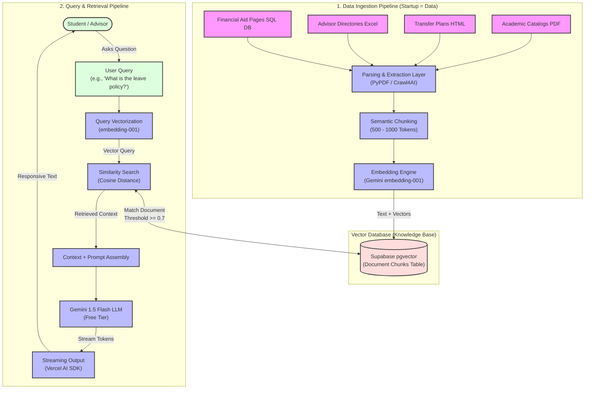

# RAG System Architecture: Success Coach Chatbot
> **Source Reference**: Hand-drawn Youtube RAG Architecture Blueprint (`Screenshot_20260523_020420_YouTube.jpg`)
> **Design Philosophy**: 100% Free & Open-source Hobby Tier, optimized for minimal latency and high similarity precision.

---

## 1. High-Level Architectural Flow

Below is the visual implementation of the Success Coach Chatbot architecture, divided into the **Data Ingestion Pipeline (Startup = Data)** and the **Query & Retrieval Pipeline (Similarity Search)**.



---

## 2. Ingestion Pipeline Deep Dive (Startup = Data)

The system treats data acquisition as a discrete offline/background job. Data sources are scraped, converted, partitioned, and stored in our central Vector database before the LLM can access them.

### 📥 A. Data Sources
We support four key ingestion pipelines as shown in the YouTube RAG blueprint:
1. **Academic Catalogs (`.pdf`)**: Dallas College course catalogues containing requirements, prerequisites, and program paths.
2. **Transfer Plans & Directories (`.html`)**: Web pages detailing advisor contact directories and university articulation agreements (e.g., UT Dallas transfer guides).
3. **Schedules & Rosters (`.xlsx`)**: Local sheets containing dates, room numbers, and counselor assignments.
4. **Student/Advisor Databases (`SQL Database`)**: Public directories or mock SQL servers containing general enrollment templates.

### ⚙️ B. Ingestion Stages
1. **Parsing Layer**:
   - **Web/HTML**: Crawl4AI automatically strips script tags, navbars, and headers, returning sanitized Markdown formatting.
   - **PDFs**: Open-source packages (`pdfplumber` or `pdf-parse`) convert catalog PDFs into clean plain-text representations.
   - **Tables/Excel**: Parsed row-by-row and formatted into structured strings: `[Field: Value]` to maintain layout semantics.
2. **Semantic Chunking**:
   - To keep embedding inputs concise and preserve specific context, the text is sliced into chunks of **500 to 1,000 tokens**.
   - An overlap of **10% (50–100 tokens)** is enforced to ensure sentences crossing boundary markers do not lose context.
3. **Vector Embeddings (Text $\rightarrow$ Vectors)**:
   - Chunks are sent to the **Gemini embedding API (`embedding-001`)** or mapped locally using open-source models like `all-MiniLM-L6-v2` via HuggingFace transformers in Node.js.
   - Outputs a **768-dimensional dense vector** representing the semantic meaning of that specific text chunk.
4. **Vector Database Loading**:
   - Chunks are uploaded to the `supabase` instance inside the `document_chunks` table containing:
     - `id` (UUID primary key)
     - `content` (Clean scraped Markdown text)
     - `metadata` (JSON: source URL, campus, degree name, section header)
     - `embedding` (768-dimensional array of float32s, indexed with `pgvector` HNSW indexes)

---

## 3. Query & Retrieval Pipeline (Similarity Search)

Once seeded, the database behaves as our **Knowledge Base**. When a student requests information, the search is local and deterministic before running the generative model.

### 🔄 A. Step-by-Step Execution Sequence

```
[Student Query] ──> [Embed Query] ──> [Cosine Search on Vector DB] ──> [Retrieve Top Chunks]
                                                                               │
[Stream Output] <── [Gemini 1.5 Flash] <── [Context + System Prompt] <─────────┘
```

1. **User Request**: A student asks: *"Where is the success coaching office at Richland campus?"*
2. **Real-time Query Vectorization**:
   - The user's query string is converted to a vector embedding using the same model (`embedding-001`) to ensure coordinates are aligned in the same vector space.
3. **Similarity Search**:
   - The server triggers a SQL query inside Supabase executing a cosine similarity threshold search:
     ```sql
     SELECT content, metadata, 1 - (embedding <=> query_embedding) AS similarity
     FROM document_chunks
     WHERE 1 - (embedding <=> query_embedding) >= 0.70
     ORDER BY similarity DESC
     LIMIT 4;
     ```
   - This isolates the **top 4 most relevant text segments** directly answering where the Richland success coaching offices reside.
4. **Prompt Assembly**:
   - The server routes compile the retrieved contexts into a single text block.
   - It appends a standard System Guardrail Prompt:
     ```text
     You are the Dallas College Success Coach AI Advisor. Answer the student's question ONLY using the provided Context below.
     
     Context:
     ---
     {retrieved_chunks}
     ---
     
     If the context does not contain the answer, reply: "I'm sorry, I couldn't find that specific detail in our official catalogs. Please contact a success coach directly at [Insert Link]."
     ```
5. **Inference Execution**:
   - The compiled prompt is sent to Google's **Gemini 1.5 Flash** (Free Tier via OpenRouter or Gemini API keys).
6. **Streaming UI Output**:
   - The response tokens stream word-by-word in real time through the **Vercel AI SDK** (`useChat` hook), reducing perceived latency and displaying answers instantly in the student's chatbot window.

---

## 4. Open Source & Free Tier Constraints Compliance

| RAG Component | Free-Tier Selection | Free Limit Details | Action on Overflow |
| :--- | :--- | :--- | :--- |
| **LLM Inference** | Google Gemini 1.5 Flash | **15 RPM / 1M TPM** (Free API Tier) | Fallback to basic rate limiter, notify users to try in 60s. |
| **Vector DB** | Supabase (pgvector) | **500MB DB Size / 1GB File Storage** | Prune old chat logs, keep catalog vectors static (< 50MB). |
| **Hosting** | Vercel Serverless | **100 GB Bandwidth / 10s Execution** | Optimize edge functions; cache popular queries via LocalStorage. |
| **Ingestion Engine**| Google Colab / Local script | **Free RAM / T4 GPU Runtime** | Split scraping jobs into sub-directories or run locally. |
