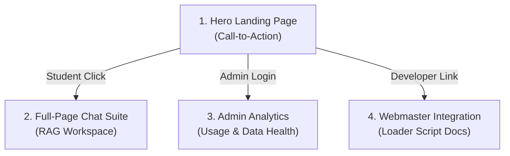

# Standalone Website Design & UI Specifications
> **Architecture**: Standalone Web Portal (`dc-success-coach.vercel.app`) separate from the official `dallascollege.edu` website.
> **Design Philosophy**: High-fidelity, premium dark-mode-first aesthetic with glassmorphism, Outfit typography, and dynamic micro-animations.

---

## 1. Visual Identity & Brand System

Because this portal is built and maintained by the Dallas College AI Club (and hosts both the full-page chat experience and developer dashboards), it uses a modern, tech-forward design rather than the static layout of the main college website.

### 🎨 A. Curated Color Palette (HSL Tailored)
* **Background Primary**: `hsl(222, 47%, 6%)` (Deep Space Blue - #030712 equivalent)
* **Background Secondary**: `hsl(217, 33%, 12%)` (Slate Midnight - #111827 equivalent)
* **Accent Primary (Active/Brand)**: `hsl(263, 70%, 50%)` (Electric Violet gradient to `hsl(221, 83%, 53%)` Royal Blue)
* **Accent Success**: `hsl(142, 71%, 45%)` (Neon Teal/Emerald)
* **Text Primary**: `hsl(210, 40%, 98%)` (Soft White)
* **Text Muted**: `hsl(215, 20%, 65%)` (Cool Gray)
* **Border Color**: `hsla(217, 30%, 20%, 0.5)` (Semi-transparent Slate)

### ✍️ B. Typography & Fonts
* **Primary Headers (Titles, Hero)**: **Outfit** (Google Fonts) - Clean, geometric, and modern.
* **Body & UI Controls**: **Inter** (Google Fonts) - Extremely legible at small sizes, excellent tracking.

### 🫧 C. Glassmorphism & Visual Accents
* **Card Panels**: `background: rgba(17, 24, 39, 0.7); backdrop-filter: blur(12px); border: 1px solid hsla(217, 30%, 30%, 0.3);`
* **Glow Effects**: Radial ambient background blur circles (`rgba(139, 92, 246, 0.15)` and `rgba(59, 130, 246, 0.15)`) behind the hero card components.

---

## 2. Standalone Page Layouts & User Journeys

The standalone portal features four primary sections:



### 🏠 1. The Hero Landing Page
* **Above the Fold**:
  - Left Column: An animated header reading *"Navigate Your College Journey with Confidence"* followed by a list of quick action chips (e.g., *"Check My Prerequisites"*, *"Find Financial Aid deadlines"*, *"Contact Richland Advisors"*).
  - Right Column: An interactive, floating 3D-style mockup card of the chatbot widget, featuring the waving robot mascot and displaying live mock response animations.
* **Mascot Callout Banner**:
  - A circular frame containing our custom robot helper mascot (with the blue-and-red tie and star emblem) popping up dynamically with a bouncing hover effect.

### 💬 2. The Full-Page Chat Suite
For students who want to map out complex semesters or review extensive documents, the floating widget is insufficient. Clicking "Open Workspace" loads a split-pane layout:
* **Left Sidebar**:
  - **Saved Sessions**: Session history cards with title summaries automatically generated by the LLM.
  - **Resource Shortcuts**: Quick links to the Dallas College PDF Catalog, Academic Calendar, and FAFSA updates.
* **Main Chat Pane**:
  - An interactive chat timeline using the **Vercel AI SDK** with smooth markdown streaming.
  - **Dynamic Citation Tray**: Clicking any superscript citation number (e.g., `[1]`) slides open a drawer on the right showing the exact catalog paragraph extracted from the database.

### 📊 3. The Admin Analytics Dashboard
Designed for AI Club project managers and college success advisors to monitor performance.
* **Metric Cards**:
  - *Total Conversations*: Live rolling ticker.
  - *Answer Trust Rate*: Percentage of responses where the student clicked the citation links (validating RAG accuracy).
  - *RAG Fallback Rate*: Count of queries resulting in *"I'm sorry, I couldn't find that detail..."* to highlight catalog gaps.
* **Data Stream (n8n-style Node Graph)**:
  - A visual canvas displaying the live pipeline: `Scraper` $\rightarrow$ `Embedding (text-embedding-004)` $\rightarrow$ `Supabase (pgvector)` $\rightarrow$ `Chat Endpoint`. Clicking nodes reveals detailed processing times and logs.

### 🔌 4. The IT Integration & Webmaster Portal
Contains resources for other student clubs or university departments to embed the widget.
* **Dynamic Code Playground**:
  - A live code editor displaying the embedding snippet:
    ```html
    <!-- Add this snippet to the bottom of your <body> tag -->
    <script 
      src="https://dc-success-coach.vercel.app/widget-loader.js" 
      data-theme="dark" 
      async>
    </script>
    ```
  - Customizable properties panel to live-preview changes in the widget theme (Colors, Greeting messages, Default chips).

---

## 3. Micro-Animations & CSS Transitions

We implement CSS-only micro-animations to keep the site responsive, premium, and alive without bloating CPU/memory resources:

1. **The Mascot Hover Wave**:
   ```css
   .mascot-svg:hover .mascot-arm-left {
     animation: wave-hello 0.8s ease-in-out infinite alternate;
     transform-origin: 20px 62px;
   }
   @keyframes wave-hello {
     0% { transform: rotate(0deg); }
     100% { transform: rotate(22deg); }
   }
   ```
2. **Shimmer Gradients**: Accent buttons utilize a sliding background gradient that shifts from purple to blue on hover:
   ```css
   .btn-primary {
     background: linear-gradient(135deg, hsl(263, 70%, 50%), hsl(221, 83%, 53%));
     background-size: 200% 200%;
     transition: background-position 0.4s ease, transform 0.2s ease;
   }
   .btn-primary:hover {
     background-position: right center;
     transform: translateY(-2px);
     box-shadow: 0 10px 20px rgba(139, 92, 246, 0.3);
   }
   ```
3. **Smooth Slide-Up (Widget and Drawers)**:
   ```css
   .chat-drawer {
     transition: transform 0.3s cubic-bezier(0.16, 1, 0.3, 1), opacity 0.3s ease;
   }
   ```
