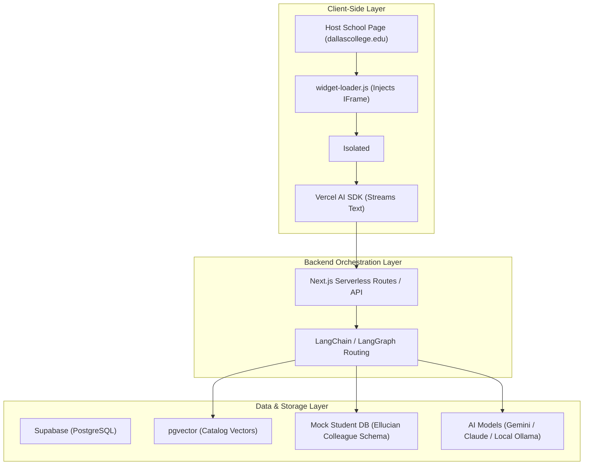

# Technical Directive: Success Coach Chatbot
> **System Architecture**: Multi-Layer Modular RAG and Tool-Calling Agent.
> **Philosophy**: Built using a Brain/Hands Architecture. Lightweight embedding, fast response latency, scalable databases, and modular pipelines.

---

## 1. System Architecture Diagram



---

## 2. Technical Stack Specifications

### 💻 Frontend & Widget Integration
1. **The Host Snippet (`widget-loader.js`)**:
   - A tiny, lightweight Vanilla JS script that university webmasters embed.
   - Responsible for creating a floating CSS button at the bottom-right of the window.
   - On click, it slides up an isolated `<iframe>` pointing to our hosted UI.
   - *Why an iframe?* It guarantees that Dallas College's page CSS will never break our chat layout, and our Tailwind/Vanilla styles won't mess up the school's layout.
2. **The Chat UI Window (`ChatWindow.jsx`)**:
   - Built inside a modern Next.js/React framework.
   - Integrates the **Vercel AI SDK** (`useChat` hook) to automatically handle streaming, UI message states, and standard system prompts.

### ⚙️ Backend & Orchestration
1. **Runtime & Server**:
   - Next.js Serverless API routes (`/api/chat/route.ts`) powered by Node.js.
2. **AI Orchestration Framework**:
   - **LangChain / LangGraph (JS/TS)**: Handles standard agentic tool execution, conversation history buffering, and vector routing.
3. **Model Configuration**:
   - **Production**: Google Gemini 1.5 Flash (low latency, high context, completely free Tier) or Claude 3.5 Sonnet.
   - **Development**: Local Ollama executing `gemma2` or `llama3`.

### 🗄️ Database, Vectors, & Data Pipeline
1. **Database Platform**:
   - **Supabase (PostgreSQL)** for session state, chat logs, and vector storage.
2. **Vector Capabilities**:
   - **pgvector extension** enabled on Supabase, allowing high-performance similarity search on course descriptions and catalogs.
3. **Database Translator (ORM)**:
   - **Prisma ORM** or **Drizzle ORM** (TS Types generated automatically based on SQL schemas).
4. **Scraping Pipeline**:
   - **Crawl4AI** / **Playwright** (Python scripts) running in Google Colab. Converts crawled pages to clean Markdown chunks, creates embeddings (`text-embedding-3-small` or Gemini embeddings), and uploads them via Prisma/Drizzle.

---

## 3. Key Core Workflows

### 🔍 Workflow A: RAG (Retrieval-Augmented Generation) for Public Catalog
When a student asks: *"What are the requirements for the AAS Cybersecurity degree?"*
1. Next.js API receives the query.
2. The user query is converted into a vector embedding.
3. LangChain performs an inner product search on the Supabase vector table:
   ```sql
   SELECT content, similarity 
   FROM match_documents(query_embedding, match_threshold := 0.7, match_count := 3);
   ```
4. Chunks are appended to the system prompt.
5. The LLM processes the query with context and streams the clean markdown response to the client.

### 💼 Workflow B: Private Data Retrieval (Mock Ellucian Colleague API)
To safely demonstrate automated student aid and personalized scheduling without using actual FERPA-protected systems, the backend links to a **Mock Colleague API**:
1. **Mock Table Schema (`student_profiles`)**:
   - `student_id` (e.g., `dc-89472`)
   - `first_name`, `last_name`
   - `degree_program` (e.g., `AAS Cybersecurity`)
   - `completed_courses` (JSON list: `["COSC-1436", "ITSY-1300"]`)
   - `financial_aid_status` (e.g., `FAFSA Approved - Pending Disbursement`)
2. **Tool-Calling Routine**:
   - If a user says *"What courses do I have left?"*, LangChain identifies a tool invocation `get_student_profile(student_id)`.
   - The agent queries the mock server, compares completed courses with the degree catalog requirements, and outputs: *"You have completed COSC-1436 and ITSY-1300. You need 3 more ITSY classes to complete your major."*

---

## 4. Git & Branching Strategy

To maintain codebase safety in a larger club setting, the following practices are **mandatory**:

> [!WARNING]
> Pushing directly to the `main` branch is strictly disabled. All features must be tested, linted, and reviewed.

1. **Branch Naming Standard**:
   - `feat/ui-widget-css` : Frontend UI, CSS loaders, Tailwind styles, responsive layout.
   - `feat/rag-chain-setup` : AI engineering, LangChain pipelines, prompts, streaming routers.
   - `data/catalog-scraper` : Playwright scraper, chunking logic, vector database seeders.
   - `test/guardrail-verification` : Testing suites, security checks, bias mitigation files.
2. **Pull Request Protocol**:
   - Every PR requires a clear screenshot (or video recording), a verification summary, and approval from at least one **technical lead** before merging into `main`.
