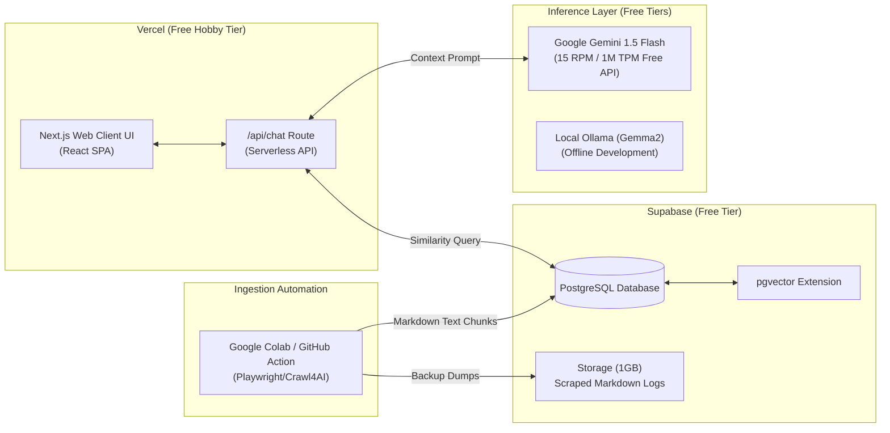

# System Infrastructure & Cloud Deployment Plan
> **Philosophy**: Built 100% on Industry-Standard Free Hobby Tiers & Open-Source Utilities.
> **Scope**: Supabase, Vercel Hosting, Gemini API, and Automated Scrapers.

---

## 1. Cloud Infrastructure Mapping

The following schema maps the connections between our hosting providers, databases, and LLM providers, highlighting the free tiers utilized.



---

## 2. Database Infrastructure (Supabase pgvector)

We utilize **Supabase** due to its underlying PostgreSQL environment and built-in support for `pgvector` similarity operations.

### 📊 A. Supabase Free Tier Allowances
* **Database Size**: **500 MB** of direct Postgres storage.
* **File Storage**: **1 GB** of asset/file storage.
* **CPU / Active state**: Database goes to sleep after 1 week of inactivity (easily awakened by triggering an API call).
* **Connections**: Up to **60 direct active connections** (scaled via pgBouncer pooler).

### 🛠️ B. Database Schema Definitions
We define our tables using **Prisma ORM** schemas to ensure complete TS auto-generation and type safety.

```prisma
// datasource config
datasource db {
  provider = "postgresql"
  url      = env("DATABASE_URL")
}

generator client {
  provider = "prisma-client-js"
}

// 1. Text Chunks Table for RAG
model DocumentChunk {
  id        String   @id @default(uuid())
  content   String   // The clean scraped Markdown snippet
  metadata  Json     // Storage for source URL, campus name, section title, etc.
  embedding Unsupported("vector(768)")? // 768-dimensional embedding coordinate
  createdAt DateTime @default(now())

  @@map("document_chunks")
}

// 2. Chat Conversation Session (Audit logs)
model ChatSession {
  id        String    @id @default(uuid())
  userId    String?   // Tracks returning students if logged in
  createdAt DateTime  @default(now())
  logs      ChatLog[]

  @@map("chat_sessions")
}

// 3. Dialogue History Audit Logs
model ChatLog {
  id        String      @id @default(uuid())
  sessionId String
  session   ChatSession @relation(fields: [sessionId], references: [id], onDelete: Cascade)
  role      String      // "user" or "assistant"
  content   String      // Raw dialogue exchange
  createdAt DateTime    @default(now())

  @@map("chat_logs")
}
```

### ⚡ C. HNSW Index Optimization
To ensure similarity retrieval executes in under **50 milliseconds** (protecting our 1.2s total latency budget), we build an **HNSW (Hierarchical Navigable Small World)** vector index inside Supabase:
```sql
CREATE EXTENSION IF NOT EXISTS vector;

CREATE INDEX ON document_chunks 
USING hnsw (embedding vector_cosine_ops) 
WITH (m = 16, ef_construction = 64);
```

---

## 3. Server & Web Hosting (Vercel Serverless)

Our Next.js frontend, static embed loaders, and routing pipelines are deployed entirely to **Vercel**.

### ☁️ A. Vercel Hobby Tier Allowances
* **Bandwidth**: **100 GB** per month (highly sufficient for millions of chat message transactions).
* **Serverless Executions**: Max **10 seconds execution duration** per serverless function.
  - *Why this matters*: A standard LLM inference can take 2-4 seconds. To prevent timeouts, we **MUST stream** the tokens back immediately.
* **Serverless Functions**: Global Edge network deployment out-of-the-box.

### 🌐 B. The Cross-Origin Isolation (`widget-loader.js`)
To protect Dallas College host sites, our floating JS loader isolation is strictly structured:
* **The Snippet**: Webmasters add `<script src="https://dc-success-coach.vercel.app/widget-loader.js" async></script>` to their layout.
* **The Loader**: On window load, the script creates a floating button. Clicking it dynamically appends an `<iframe>` container pointing to `https://dc-success-coach.vercel.app/chat`.
* **The IFrame Guarantee**: By isolating styling inside an iframe, Tailwind styles and global CSS resets inside our React workspace will never leak onto the official Dallas College pages.

---

## 4. AI Inference Engine (Gemini Flash API Free Tier)

To avoid billing setups or credit card requirements for the student club, we configure our primary inference routes to utilize the free API tiers.

### 🔑 A. API Configuration Matrix

| Model Tier | Selection | Role | Provider | Cost | Limits |
| :--- | :--- | :--- | :--- | :--- | :--- |
| **Production LLM** | Google Gemini 1.5 Flash | Core generator & planner | Gemini API | **$0.00** | 15 RPM / 1M TPM |
| **Production Embed**| Google embedding-001 | Vectorizing chunks & queries | Gemini API | **$0.00** | 1,500 RPM |
| **Development LLM** | Ollama (Gemma2) | Local testing & script runs | Local CPU/GPU | **$0.00** | Unlimited (Offline) |

### 🛡️ B. Rate Limiting Protection (Staying Free Safely)
To prevent malicious scripts or spam loops from exhausting the **15 Requests Per Minute** limit on the free Gemini key, we implement an Edge-based token-bucket rate limiter inside Next.js middleware:
```typescript
import { NextResponse } from 'next/server';
import type { NextRequest } from 'next/server';
import { Ratelimit } from '@upstash/ratelimit'; // Or simple memory-based bucket
import { Redis } from '@upstash/redis';

// Note: If Upstash is not used, we can implement local state cache inside serverless memory
export async function middleware(request: NextRequest) {
  const ip = request.ip ?? '127.0.0.1';
  
  // Custom limit: 5 requests per minute per IP address
  const limitCount = 5;
  const windowSeconds = 60;
  
  // Limit logic checker...
  // If exceeded, return:
  // return new NextResponse('Too many requests. Please try again shortly.', { status: 429 });
  
  return NextResponse.next();
}
```

---

## 5. System Cost Comparison Breakdown

| Services | Enterprise Architecture | AI Club Free Tier Architecture | Monthly Savings |
| :--- | :--- | :--- | :--- |
| **Vector DB** | Pinecone Standard ($70/mo) | Supabase pgvector ($0.00) | **$70.00** |
| **Hosting** | AWS / GCP Node Cluster ($50/mo) | Vercel Hobby Tier ($0.00) | **$50.00** |
| **LLM Processing** | OpenAI GPT-4o API (~$35/mo) | Gemini 1.5 Flash ($0.00) | **$35.00** |
| **Embeddings** | Cohere API (~$10/mo) | Gemini embedding-001 ($0.00) | **$10.00** |
| **Total Monthly** | **$165.00** | **$0.00** | **$165.00 / month** |
