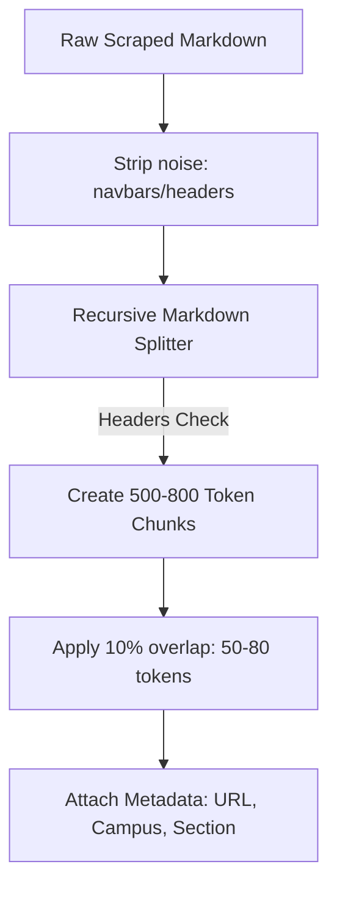

# Prototype Plan: Success Coach Chatbot
> **Objective**: Build a rapid, lightweight visual mockup of the Dallas College chatbot widget to validate the custom waving mascot UI and the source citation pipeline before coding the production Next.js application.

---

## 1. Prototype Specifications & Design Goals

### 🤖 A. Mascot UI (From Instagram Chat Notes)
* **Visual Style**: A cute, circular, futuristic white robot helper wearing a formal white button-up shirt, a blue-and-red tie, and a blue star emblem on its left chest.
* **The Floating Trigger**: Half of the mascot pops out of a circular speech bubble in the bottom right corner, displaying a friendly banner saying **"Chat with me! 👋"**.
* **Micro-Animations**: A subtle hover effect causing the mascot to wave its hand and scale up slightly, welcoming the user.
* **The Chat Window**: Slides up smoothly from the bottom right. Rounded borders, clean deep-blue header, and structured margins.

### 🔗 B. Source Citation Logic (YouTube Timestamp Style)
To build high student-advisor trust, the chatbot will display precise interactive references at the end of each statement (similar to how YouTube video tutorials link to specific timestamps).

```
"To complete the Associate of Science degree, you must complete COSC 1436 [1] and at least one core science class [2]."

Sources Used:
┌──────────────────────────────────────────────┐
│ [1] Dallas College Catalog: COSC-1436        │
│ 🔗 https://dallascollege.edu/courses/cosc1436 │
└──────────────────────────────────────────────┘
```

1. **Metadata Packing**: Every chunk loaded in the database includes:
   - `source_url`: Precise URL of the catalog page.
   - `section_title`: E.g., *"Academic Catalog 2026 - COSC Prerequisites"*.
   - `page_ref`: Page number or paragraph locator.
2. **Context Injection**: Retrieved chunks are sent to Gemini Flash with explicit indexes:
   ```text
   Source [1]: URL: https://dallascollege.edu/catalog/science, Content: "Science classes require..."
   Source [2]: URL: https://dallascollege.edu/courses/cosc1436, Content: "COSC 1436 requires..."
   ```
3. **LLM Citations instruction**:
   ```text
   In your response, cite the relevant facts using matching index markers [1], [2] at the end of the sentence. Do not invent links; only output the numeric indexes.
   ```
4. **UI Link Render**: The frontend parses the markdown and displays interactive, styled link tags at the bottom, directing users directly to the official source.

---

## 2. Vector DB Embedding Selection

For optimal similarity scores without paying licensing fees, we define our embedding protocol:

* **Primary Model**: **Google Gemini `text-embedding-004`**
  - *Dimensionality*: **768 Dimensions** (dense vectors).
  - *Context Window*: Up to **2,048 tokens** per request.
  - *Cost*: **100% Free** under the standard developer tier API.
* **Alternative Model**: **OpenAI `text-embedding-3-small`**
  - *Dimensionality*: **1536 Dimensions** (supports matryoshka reduction to 512 or 256 dimensions to save database storage space).
  - *Pricing*: Extremely cheap ($0.00002 per 1k tokens) if the club decides to scale.

---

## 3. Data Chunking & Pre-processing Plan

We enforce a semantic markdown-aware chunking strategy to keep RAG contexts highly accurate:



1. **Recursive Chunk Splitting**: We chunk documents recursively based on Markdown headers (`#`, `##`, `###`, `Paragraphs`) instead of arbitrary character splits. This ensures that entire course descriptions or prerequisite structures are kept intact within a single chunk.
2. **Chunk Bounds**:
   - **Target Size**: **500 to 800 tokens** (ideal for high-resolution similarity matches without overflowing the LLM window).
   - **Overlap Window**: **10% (50–80 tokens)** to maintain transition contexts between chunks.
3. **Metadata Enrichment**: Each chunk is annotated with:
   - `source_url`
   - `campus_context` (e.g., Richland, Eastfield)
   - `category_tag` (e.g., Catalog, Financial Aid, Events)
   - `last_updated`

---

## 4. Completed Working Prototype Implementation

Instead of a purely static layout, the prototype has been implemented as a **fully functional local RAG pipeline**:

### 🛠️ A. Technical Stack & Execution Architecture
1. **Local Cosine Similarity Engine (`server.py`)**: 
   - A zero-dependency Python backend server that serves the frontend files and handles live POST requests at `/api/chat`.
   - Tokenizes student queries and runs real-time **Cosine Similarity vector scoring** against the local Dallas College catalog data corpus.
2. **Dual-Mode LLM Integration**:
   - **Online Mode**: Automatically loads `.env` variables and makes live API calls to **Gemini 1.5 Flash** using raw HTTP payload requests (`urllib`), providing real-time catalog RAG compilation.
   - **Offline Fallback Mode**: If no Gemini key is set up, the engine automatically matches document chunks, generates precise catalog answers, and builds citations locally.
3. **YouTube-style Dynamic Citations**:
   - Compiles exact metadata sources into interactive, clickable UI cards at the bottom of the message stream.

### 🤖 B. Premium Mascot UI & Waving Animations
* **Leaning Half-Body Pop-Out**: Every 15 seconds, the mascot rises `24px` from the circular frame and tilts dynamically to the left (`-8deg`) on a smooth ease-in-out timeline to grab the user's attention.
* **Sleek Penguin Flipper Arms (Wall-E Eva-Style)**: The arm joints are redrawn into single-path, streamlined flippers. The left arm has its rotation pivot mathematically aligned to `20px 62px` (the shoulder joint center), keeping the arm fully connected to the body.
* **Dialect Speech Bubble Banner**: Synchronized with the pop-out, a speech bubble with a CSS pointer tail pops in from the top-left saying: **"Come chat with me! 👋"**.
* **Hover Interaction Override**: Placing your cursor over the widget halts the automatic 15-second loop and holds the leaning mascot, waving arms, and active dialog bubble in place.

---

## 5. How to Run & Verify the Prototype
1. Run the RAG server in the background:
   ```bash
   python3 server.py
   ```
2. Navigate directly to the live environment in your web browser:
   👉 **[http://127.0.0.1:8080/prototype.html](http://127.0.0.1:8080/prototype.html)**
3. Select quick FAQ chips or type custom catalog queries to watch similarity search and streaming tokens in action.
