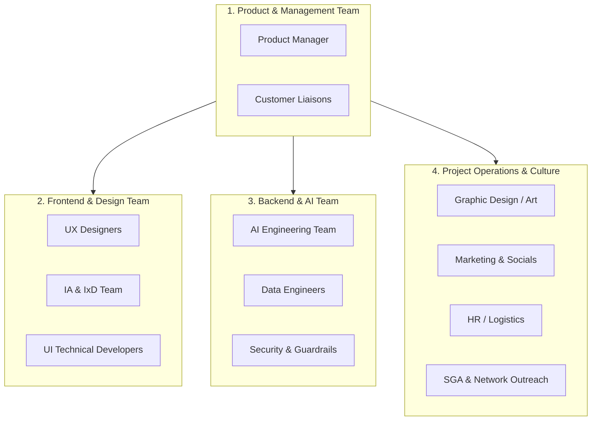

# Team Roles & Task Delegation: Success Coach Chatbot
> **AI Club Organization Directory**: Defining structural responsibilities and task assignments to ensure smooth collaboration across all club members.

---

## 1. Core Divisions & Task Map

---

## 2. Detailed Roles & Responsibilities

### 1. Product & Management Team
* **Product Manager (PM)**:
  - *Role*: Liaison between client needs (Dallas College) and technical teams.
  - *Tasks*: Tracks sprint milestones, manages the GitHub project board, and ensures the MVP features are completed on schedule.
* **Customer Representative**:
  - *Role*: Simulates student, student aid, and advisor users.
  - *Tasks*: Provides regular usability feedback and helps shape the RAG knowledge priorities based on real needs.
* **Infrastructure & Architecture Team**:
  - *Role*: Systems leads.
  - *Tasks*: Decides deployment targets (Vercel, Supabase), setups the staging environments, structures the relational database connections, and ensures overall system latency stays under **1.2 seconds**.
* **Testers**:
  - *Role*: Quality assurance specialists.
  - *Tasks*: Builds automated prompt-evaluation tests, runs query suites, and validates RAG response correctness.

### 2. Frontend Team (UI/UX)
* **UX & Interaction (IA/IxD)**:
  - *Role*: User experience designers.
  - *Tasks*: Maps user flows, defines widget triggers, wireframes the chat interface, and designs interactive bubble behaviors.
* **UI Technical Developers**:
  - *Role*: Frontend engineers.
  - *Tasks*: Codes the embed snippet (`widget-loader.js`) in Vanilla JS and implements the reactive `ChatWindow.jsx` inside the Next.js/Tailwind CSS project.

### 3. Backend & AI Engineering Team
* **AI Engineering Team**:
  - *Role*: LLM and RAG specialists.
  - *Tasks*: Codes the LangChain orchestration logic, configures prompt templates, handles context injection, and sets up advanced tool-calling agents.
* **Data Team**:
  - *Role*: Data acquisition leads.
  - *Tasks*: Configures Crawl4AI/Playwright, scrapes dallascollege.edu, logical-chunks pages, generates embeddings, and seeds the Supabase pgvector table.
* **Security & Guardrails**:
  - *Role*: Security specialists.
  - *Tasks*: Validates data privacy compliance (FERPA guidelines), prevents prompt injections, and configures advisor escalation overrides.

### 4. Project Operations & Culture
* **Graphic Design & Art**:
  - *Role*: Brand designers.
  - *Tasks*: Outlines the chatbot visual branding, custom logos, icons, and color palettes matching Dallas College branding.
* **Marketing & Socials**:
  - *Role*: Public relations specialists.
  - *Tasks*: Drafts announcement emails, promotes the chatbot across student clubs, and manages AI Club social updates.
* **Outreach & Funding (SGA)**:
  - *Role*: Finance and student government liaisons.
  - *Tasks*: Promotes the chatbot to the Student Government Association (SGA) for formal integration, pursues campus funding opportunities, and schedules outreach events.
* **HR, Operations, & Logistics**:
  - *Role*: Internal organizers.
  - *Tasks*: Manages meeting schedules, note-taking, room reservations, and handles food/snacks logistics for club hackathons.

---

## 3. Team Member Directory & Assignment Grid

Use this table to map active club members to their designated roles and track their high-level task completions.

| Team | Member Name(s) | Key Deliverables | Status |
| :--- | :--- | :--- | :--- |
| **Product & Management** | *[Assign Student]* | Track MVP requirements, coordinate review meetings. | Upcoming |
| **Infrastructure / Arch** | *[Assign Student]* | Configure GitHub, Supabase DB schema, and Vercel hosting. | Upcoming |
| **Data Team** | *[Assign Student]* | Scrape college pages via Google Colab, chunk Markdown data. | Upcoming |
| **AI Engineering** | *[Assign Student]* | Code Next.js api routes, seed pgvector, write prompt files. | Upcoming |
| **Testers & Security** | *[Assign Student]* | Build 50-query test suite, prompt injection checks. | Upcoming |
| **UI/UX Designers** | *[Assign Student]* | Wireframe floating widget layouts, button icons. | Upcoming |
| **UI Developers** | *[Assign Student]* | Develop widget host JS file, code responsive chat bubbles. | Upcoming |
| **Marketing & Brand** | *[Assign Student]* | Generate logo, draft promotional newsletter. | Upcoming |
| **Ops & Logistics** | *[Assign Student]* | Maintain minutes, room setups, snacks for sprints. | Upcoming |
| **Outreach & SGA** | *[Assign Student]* | Connect with campus advisors and SGA officers. | Upcoming |
