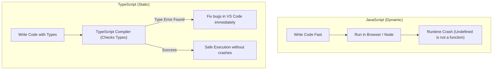

# Technical Stack Plan: Success Coach Chatbot
> **Goal**: 100% Free Hobby Tier Architecture, designed for rapid, lightweight, scalable deployment.

---

## 1. The Core Architecture Layers

| Architectural Layer | Technology Selected | Pricing / Tier | Main Purpose |
| :--- | :--- | :--- | :--- |
| **Workspace & Dev Tools** | VS Code + Antigravity CLI | 100% Free | Group pair programming & automation scripts. |
| **Version Control & Hosting** | GitHub + Vercel Hosting | Free Hobby Tier | Hosting the chatbot web interface and backend routes. |
| **Frontend Framework** | Next.js (React) + Tailwind CSS | 100% Free | Building the reactive chat layout. |
| **Streaming UI Layer** | Vercel AI SDK | 100% Free | Smooth word-by-word token streaming inside components. |
| **Orchestration / Logic** | LangChain / LangGraph (JS/TS) | 100% Free | Handling prompt templates, RAG integration, and tools. |
| **Data Ingestion Engine** | Crawl4AI / Playwright + Colab | Free Tiers | Scraping and chunking university webpages into Markdown. |
| **Database & Vectors** | Supabase (PostgreSQL + pgvector) | Free Hobby Tier | Vector similarities, student profile logs, and schemas. |
| **Database Connector** | Prisma ORM or Drizzle ORM | 100% Free | Translating database structures into TypeScript models. |
| **AI Inference API** | Gemini Flash API (via OpenRouter) | Free Developer Tiers | Fast, high-context LLM token processing. |

---

## 2. Deep Dive: Key Technical Selections

### 🚀 1. The Streaming UI: Vercel AI SDK
* **What it is**: An industry-standard frontend library built for AI streaming interfaces.
* **Why we use it**: Instead of forcing a student to wait 5–8 seconds for an entire paragraph to process in the background, this library handles raw token streaming from Next.js server routes out of the box. 
* **Key Benefit**: The bot's reply prints on the screen word-by-word instantly, making the interaction feel highly premium, fluid, and responsive.

### 🗄️ 2. The Database Connector: Prisma vs. Drizzle ORM
* **What it is**: An Object-Relational Mapper (ORM) that acts as a translator between our code and the Supabase PostgreSQL database.
* **Why we use it**: Writing raw SQL queries inside server functions is highly prone to typos and security risks. 
* **Key Benefit**: By defining schemas in TypeScript, the ORM automatically compiles matching TypeScript types. If a developer makes a typo in a database column name, the editor immediately catches it with red squiggly lines before compilation, protecting the backend from runtime errors.

### 🕸️ 3. The Data Ingest: Crawl4AI (Async Python)
* **What it is**: An async python library built specifically to scrape and convert webpages for Large Language Models.
* **Why we use it**: Traditional scrapers extract messy HTML, including navbars, header scripts, and trackers, which bloats the token count.
* **Key Benefit**: Crawl4AI strips away layout code and returns clean Markdown. This allows the Data Team to upload highly concise, accurate text chunks to the database without manually writing complex filters in Python.

---

## 3. Explainer: JavaScript vs. TypeScript (JS vs. TS)

A key architectural discussion in the club is whether to write the application in pure **JavaScript** or **TypeScript**. Below is the comparative analysis.

### 🟡 JavaScript (JS)
* **Pros**:
  - Zero compilation step (runs directly in standard environments).
  - Faster initial onboarding for club members who have never used typed systems.
* **Cons**:
  - Type definitions are completely dynamic. If the database schema changes, you will only notice the bug when the app crashes at runtime.
  - Harder to collaborate on. When 15 club members contribute code, it is extremely easy to accidentally break functions.

### 🔵 TypeScript (TS) - *Recommended for the Club*
* **Pros**:
  - **Static Type Checking**: Catches errors in variables, parameters, and database schemas instantly in your editor.
  - **Better Autocomplete**: Hovering over any object reveals its structure, dramatically boosting development speeds for beginners.
  - **Safe Collaboration**: Ensures all pull requests comply with matching parameters, keeping the codebase extremely stable.
* **Cons**:
  - Slight learning curve for members who are only familiar with basic JS.
  - Requires a compilation/build step before execution.

> [!TIP]
> **Club Decision**: We will build the Next.js frontend and LangChain backend using **TypeScript (Next.js TS template)** to guarantee type safety across our multi-disciplinary team. However, the external `widget-loader.js` script will be written in highly compact **Vanilla JavaScript** to ensure it remains a single, dependencies-free snippet that is easy to embed on any webpage.
