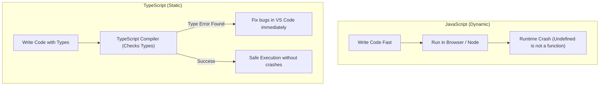

# Technical Stack Plan: Success Coach Chatbot
> **Goal**: 100% Free Hobby Tier Architecture, designed for rapid, lightweight, scalable deployment.

---

## 1. Prototyping vs. Production Stack

To balance fast developer loops with production-ready scalability, the team has structured the project into two distinct phases:

| Architectural Layer | Prototyping Stack | Production Stack | Pricing / Tier | Purpose |
| :--- | :--- | :--- | :--- | :--- |
| **Workspace & Automation** | Aider / VS Code | *TBD (Aider, OpenCode, AgentZero)* | 100% Free | Developer automation & multi-agent harnesses. |
| **Hosting & Cloud** | Localhost | **Vercel** (most likely) | Free Hobby Tier | Deploying frontend UI & serverless backend. |
| **Frontend Framework** | **Streamlit** (Python) | **React / Next.js** (TypeScript) | 100% Free | User interface & chat widget components. |
| **Backend & Runtime** | Streamlit Server (Python) | **Node.js** | 100% Free | Backend API routing, rate limits, and LLM orchestration. |
| **Vector Database** | **ChromaDB** (Local/Offline) | **Neon Postgres** (`pgvector`) | Free Hobby Tier | Storing embeddings and course catalogs. |
| **Database Connector** | Native Python / Client | **Prisma ORM** or **Drizzle ORM** | 100% Free | Mapping database schemas to types. |
| **Inference Layer** | OpenRouter (Gemma 2 / Qwen) | OpenRouter / Gemini Direct API | Free developer keys | Querying LLMs for response generation. |

---

## 2. Deep Dive: Key Technical Selections

### 🚀 1. The Streaming UI: Vercel AI SDK
* **What it is**: An industry-standard frontend library built for AI streaming interfaces.
* **Why we use it**: Instead of forcing a student to wait 5–8 seconds for an entire paragraph to process in the background, this library handles raw token streaming from Next.js server routes out of the box. 
* **Key Benefit**: The bot's reply prints on the screen word-by-word instantly, making the interaction feel highly premium, fluid, and responsive.

### 🗄️ 2. The Database Connector: Prisma vs. Drizzle ORM
* **What it is**: An Object-Relational Mapper (ORM) that acts as a translator between our code and the Neon Postgres database.
* **Why we use it**: Writing raw SQL queries inside server functions is highly prone to typos and security risks. 
* **Key Benefit**: By defining schemas in TypeScript, the ORM automatically compiles matching TypeScript types. If a developer makes a typo in a database column name, the editor immediately catches it with red squiggly lines before compilation, protecting the backend from runtime errors.

### 🧪 3. The Prototyping Sandbox: Streamlit + ChromaDB
* **Why we use them**: Streamlit allows the team to write web UIs entirely in Python in under 50 lines of code, making it optimal for testing early scraper data. ChromaDB serves as our local, zero-setup vector database for immediate vector searches.
* **Key Benefit**: Speeds up our learning loop and lets the team experiment with chunking and prompt engineering without setting up cloud accounts.

### 🤖 4. Agent Harness Evaluation
The team is currently evaluating three agentic execution harnesses to automate development, coding, and code reviews:
1. **Aider**: Excellent for direct file-editing and terminal integration using Gemini/Claude.
2. **AgentZero**: Optimized for writing and running code in local environments with advanced shell and sub-agent calling.
3. **OpenCode**: Flexible and model-agnostic coding assistant framework.

---

## 3. Explainer: JavaScript vs. TypeScript (JS vs. TS)

A key architectural discussion in the club is whether to write the application in pure **JavaScript** or **TypeScript**. Below is the comparative analysis.

### 🟡 JavaScript (JS)
* **Pros**:
  - Zero compilation step (runs directly in standard environments).
  - Faster initial onboarding for club members who have never used typed systems.
* **Cons**:
  - Type definitions are completely dynamic. If the database schema changes, you will only notice the bug when the app crashes at runtime.
  - Harder to collaborate on. When 15 club members contribute code, it is extremely easy to accidentally break functions.

### 🔵 TypeScript (TS) - *Recommended for the Club*
* **Pros**:
  - **Static Type Checking**: Catches errors in variables, parameters, and database schemas instantly in your editor.
  - **Better Autocomplete**: Hovering over any object reveals its structure, dramatically boosting development speeds for beginners.
  - **Safe Collaboration**: Ensures all pull requests comply with matching parameters, keeping the codebase extremely stable.
* **Cons**:
  - Slight learning curve for members who are only familiar with basic JS.
  - Requires a compilation/build step before execution.

> [!TIP]
> **Club Decision**: We will build the Next.js frontend and LangChain backend using **TypeScript (Next.js TS template)** to guarantee type safety across our multi-disciplinary team. However, the external `widget-loader.js` script will be written in highly compact **Vanilla JavaScript** to ensure it remains a single, dependencies-free snippet that is easy to embed on any webpage.
