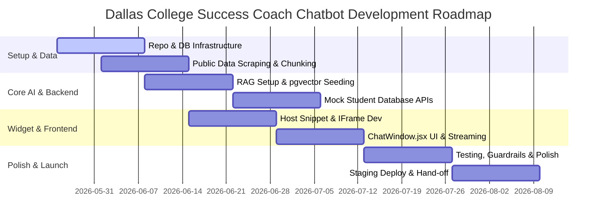

# Project Timeline: Success Coach Chatbot
> **Duration**: 10–12 Weeks Sprint Plan
> **Methodology**: Agile Sprints with bi-weekly milestone checks.

---

## 1. High-Level Milestones

---

## 2. Weekly Sprint Breakdown

### 🎯 Milestone 1: Foundation & Data (Weeks 1–2)
* **Week 1: Repo Initialization & Stack Configuration**
  - **Infrastructure**: Set up protected GitHub repository, create branches, and deploy a Supabase instance (Free tier).
  - **Architecture**: Draft the initial database schema (sessions, logs, and document chunk tables) via Prisma/Drizzle.
  - **Deliverable**: Local environments running, `main` branch protected, and database connected.
* **Week 2: Scraper Dev & Data Scraping**
  - **Data Team**: Deploy Crawl4AI/Playwright scripts on Google Colab to scrape academic catalogs, advisors, transfer plans, and FAQs.
  - **AI Engineering**: Set up local Ollama (Gemma2/Llama3) for testing embeddings and local inference.
  - **Deliverable**: Clean Markdown files stored in `.tmp/scraped_data/`.

### 🧠 Milestone 2: Vector DB & RAG Core (Weeks 3–4)
* **Week 3: Text Chunking & Embedding Seeding**
  - **Data Team**: Implement logical chunking strategies (500–1000 tokens per chunk) with metadata tags (campus, category, URL).
  - **AI Engineering**: Embed chunks using `text-embedding-3-small` and seed pgvector.
  - **Deliverable**: Complete database seed script (`prisma/seed.ts` or similar).
* **Week 4: RAG Query & Pipeline Integration**
  - **AI Engineering**: Write Next.js API routes that accept user messages, embed them, query Supabase, and feed LLM contexts.
  - **Testers**: Draft a list of 50 sample query test cases.
  - **Deliverable**: Postman collection returning correct text answers.

### 🎨 Milestone 3: Widget Integration & Frontend (Weeks 5–6)
* **Week 5: The Host Script & Container (`widget-loader.js`)**
  - **Frontend UI/UX**: Build the standalone JS file that mounts the floating chat launcher button.
  - **Architecture**: Set up an iframe environment in Next.js to isolate the chat app from host CSS rules.
  - **Deliverable**: An HTML page successfully launching a placeholder widget using the JS snippet.
* **Week 6: The Chat UI & Streaming Interface**
  - **Frontend UI/UX**: Build `ChatWindow.jsx` using Tailwind CSS, supporting typing animations, message bubbles, and smooth styling.
  - **AI Engineering**: Set up Vercel AI SDK on Next.js to stream LLM responses word-by-word.
  - **Deliverable**: High-fidelity, reactive floating chat widget that streams replies.

### 🔗 Milestone 4: Advanced Agents & Mock Integrations (Weeks 7–8)
* **Week 7: Private Student Data API (Mock Colleague)**
  - **Backend Team**: Build a lightweight FastAPI server providing endpoints for student profiles, transcript evaluations, and financial aid status.
  - **Architecture**: Establish clean schema routes for mock queries.
  - **Deliverable**: Swagger/FastAPI endpoints running with dummy student databases.
* **Week 8: Tool-Calling Agent Routing**
  - **AI Engineering**: Set up LangGraph/LangChain tool-calling agents. Teach the LLM to call `get_student_profile(id)` if users ask about scheduling, financial status, or program checks.
  - **Deliverable**: Agent seamlessly switching between general catalog RAG and mock student data tools.

### 🛡️ Milestone 5: Quality, Safety, & Polish (Weeks 9–10)
* **Week 9: Guardrails & Advisor Escalation**
  - **AI Engineering / Security**: Write system prompts that intercept sensitive questions (e.g. grading disputes, personal issues) and print advisor escalation instructions.
  - **Testers**: Rigorously prompt-inject the bot to test guardrails.
  - **Deliverable**: Verified, safe system prompt with fallback actions.
* **Week 10: Performance Optimization & Latency Check**
  - **Architecture**: Implement Redis/KV caching for frequent questions, optimize db indexing, and adjust chunk similarity thresholds to achieve < 1.2s time-to-first-token.
  - **Deliverable**: Performance report indicating rapid responsiveness and clean layouts across various screens.

### 🚀 Milestone 6: Deploy & Hand-off (Weeks 11–12)
* **Week 11: Production Deployment**
  - **Infrastructure**: Deploy the Next.js app to Vercel, link it to the Supabase database.
  - **Marketing**: Develop the official logo, write email campaigns, and schedule on-campus presentations.
  - **Deliverable**: Hosted staging URL accessible on mobile devices.
* **Week 12: Hand-off & Club Demo**
  - **Management**: Hold a live demo for Dallas College student advisors, present reports, and finalize hand-off docs.
  - **Deliverable**: Fully documented code, active widget, and project wrap-up presentation.
