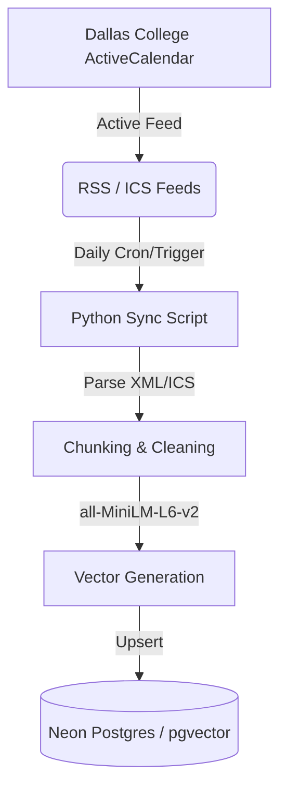

# Current Events & Academic Calendar Data Sources (Issue #13)

This technical brief documents the data feeds, endpoints, and ingestion pipeline for importing Dallas College campus events and academic calendar deadlines into the chatbot's vector store.

---

## 1. Primary Data Source

Dallas College manages its institutional events and academic calendar using **Brightly Software (ActiveCalendar)**.
- **Main Calendar URL**: [https://calendar.dallascollege.edu/](https://calendar.dallascollege.edu/)
- **API Availability**: No official public REST API is exposed directly by Dallas College. However, the ActiveCalendar platform generates standard structured feeds (RSS and ICS) for subscription.

---

## 2. Ingestion Feeds (RSS and ICS)

Instead of scraping HTML, the chatbot can programmatically parse structured syndication feeds generated by the calendar platform:

### A. Academic Calendar ICS Feed
- **Description**: Standard iCalendar (RFC 5545) file containing all semester milestones (census dates, add/drop deadlines, registration openings, finals, and breaks).
- **Format**: ICS (text-based calendar format).
- **Ingestion Method**: Parsed using libraries like `icalendar` or `icalevents` in Python.
- **Example Data Fields**:
  ```text
  BEGIN:VEVENT
  SUMMARY:Fall Semester 16-Week Census Date
  DTSTART;VALUE=DATE:20260907
  DESCRIPTION:Official reporting date for Fall 16-week classes. Last day to drop without a grade.
  URL:https://calendar.dallascollege.edu/EventDetails.aspx?data=...
  END:VEVENT
  ```

### B. Campus Events RSS Feed
- **Description**: RSS 2.0 XML feed detailing campus-specific student life activities, club events, and guest seminars.
- **Format**: XML.
- **Ingestion Method**: Parsed using Python's stdlib `xml.etree.ElementTree` or `feedparser`.
- **Example Data Fields**:
  - `<title>`: Event name (e.g., *"Richland Computer Science Club Meetup"*).
  - `<link>`: URL to event registration.
  - `<description>`: Location, campus, speaker, and time details.
  - `<pubDate>`: Creation timestamp.

---

## 3. Ingestion & Update Pipeline

To keep the vector database updated with new events and calendar deadlines, we recommend a automated sync script running inside `apps/data/`:



### Ingestion Protocol
1.  **Weekly Sync for Academic Calendar**: Since academic deadlines rarely change mid-semester, the ICS file is parsed once a week.
2.  **Daily Sync for Campus Events**: RSS feeds are polled once every 24 hours to capture new student events.
3.  **Deduplication & TTL (Time-To-Live)**:
    *   Events are matched by their unique UID or URL to prevent duplicate embeddings.
    *   **Expired Events Filter**: A filter automatically deletes database records where the event date is older than the current date (`DTEND < CURRENT_DATE`) to prevent the chatbot from recommending past events.
