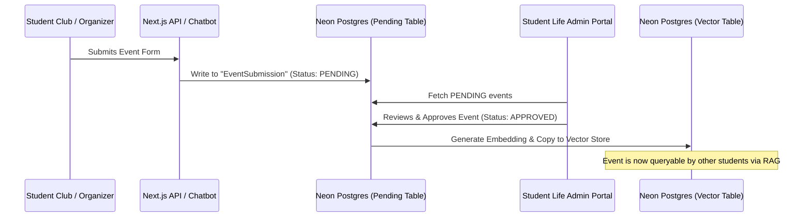

# Moderated Campus Events Workflow: Technical Design (Issue #18)

This document evaluates the workflow, validation rules, and technical architecture for processing student- and club-submitted campus events for the Success Coach Chatbot MVP.

---

## 1. Moderation Architecture

To prevent unauthorized, inaccurate, or offensive entries from appearing in chatbot queries, all event submissions must pass through a Student Life approval queue before being indexed by the vector search database.



---

## 2. Database Models

We define a dedicated Prisma model to manage the moderation state and metadata of event submissions:

```prisma
enum EventStatus {
  PENDING
  APPROVED
  REJECTED
  COMPLETED
}

model EventSubmission {
  id              String      @id @default(uuid())
  title           String
  description     String      @db.Text
  campus          String      // e.g., "Richland", "Eastfield"
  buildingRoom    String      // e.g., "Sabine Hall Room S203"
  startDate       DateTime
  endDate         DateTime
  organizerName   String      // Student group or department
  contactEmail    String      // Contact for validation
  status          EventStatus @default(PENDING)
  rejectionReason String?     @db.Text
  createdAt       DateTime    @default(now())
  updatedAt       DateTime    @updatedAt
  
  // Vector representation (only populated once status is APPROVED)
  embedding       Unsupported("vector(384)")?
}
```

---

## 3. Event Validation Rules & Policies

To ensure catalog accuracy, the moderation portal enforces the following policies:

1.  **Affiliation Verification**:
    *   Submitting organizers must specify an official student organization, academic department, or registered campus group.
    *   *Validation*: The moderation dashboard maps the submitter's email to ensure it belongs to an active student or staff member.
2.  **Explicit Date Verification**:
    *   The `endDate` must be after the `startDate` and must be a future date at the time of submission.
3.  **Automatic Expiration Policy**:
    *   Events that have already taken place should not be returned by chatbot searches.
    *   *Implementation*: A daily automated script deletes or archives all events where `endDate < CURRENT_DATE`. This keeps vector index query operations fast and prevents outdated recommendations.
