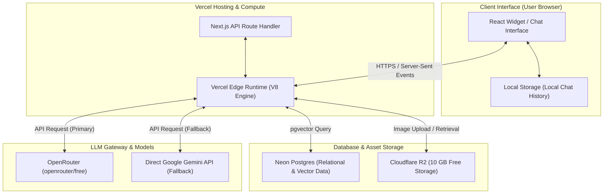

# Architectural Decision Record (ADR): Issue #10
> **Title**: Evaluation of 3rd-Party Free Tier Services & Agnostic LLM Architecture  
> **Status**: APPROVED / FINALIZED  
> **Date**: June 6, 2026  
> **Deciders**: Dallas College AI Club (Engineering & Management Teams)

---

## 1. Context & Constraints

The Success Coach Chatbot must support the indexing of over 800 course catalogs, 300 academic degree program maps, local events, and lost-and-found items. The system must deliver similarity-based answers to student questions with an end-to-end response latency of under **1.2 seconds**.

As a student-led club project, the application operates under a strict **$0.00/month budget** constraint. The architecture must maximize free-tier cloud resources while maintaining a clean, decoupled path to scale to enterprise college servers in the future.

---

## 2. Database and Vector Storage Evaluation

We evaluated database and vector storage options against our Next.js edge runtime environment and free-tier limits:

| Service | Free Tier Allowances | Framework Compatibility | Vector Support | Key Architectural Constraints | Decision |
| :--- | :--- | :--- | :--- | :--- | :--- |
| **Neon Postgres** | 500 MB Storage | High (Prisma/Drizzle/Serverless) | Yes (`pgvector`) | Compute scales to zero (cold starts) | Selected (Production) |
| **ChromaDB** | Local / Disk | High (Python Pipelines) | Yes (Native) | Local-only; not suited for serverless | Selected (Prototyping) |
| **Supabase** | 500 MB DB / 1 GB Storage | Good (JS Client) | Yes (`pgvector`) | Deactivates after 1 week of inactivity | Rejected (Alternative) |
| **Convex** | 500 MB Storage | Good (NextJS SDK) | No | Lacks native vector similarity search | Rejected |
| **Pinecone** | 2 GB Storage | Good (Node Client) | Yes (Native) | Capped at 2M write units/mo; no SQL logs | Rejected |
| **LanceDB** | Embedded / Disk | Poor (Serverless Vercel limits) | Yes (Native) | Incompatible with local VM CPU flags | Rejected |

### Technical Evaluation & Trade-offs

#### Convex
* **Vector Indexing Constraints**: Convex provides robust real-time document synchronization but lacks native support for Hierarchical Navigable Small World (HNSW) vector indexing. It is therefore unsuitable for low-latency similarity searches.
* **Storage Footprint**: The 500 MB limit is sufficient for relational logs and metadata (storing ~300,000 messages or 60,000 sessions), but insufficient if forced to store high-dimensional embeddings.

#### Neon Postgres
* **Storage Feasibility**: The 500 MB limit is sufficient for the MVP. The target corpus of ~1,100 documents chunked into ~22,000 segments (using 384-dimensional `all-MiniLM-L6-v2` embeddings) requires approximately 60 MB of storage for vectors, text content, and HNSW indexes. This leaves ~440 MB for logs and session states.
* **Connection Management**: Neon routes edge queries through PgBouncer (using the pooled connection string `-pooler`) and supports the `@neondatabase/serverless` WebSocket driver. This maintains sub-50ms query speeds and prevents serverless connection exhaustion.

#### Pinecone
* **Read Path Latency**: The free tier (`gcp-starter`) supports up to 100 requests per second (RPS). Given the application's planned 5 requests-per-minute (RPM) rate limit per IP, read capacity is not a bottleneck.
* **Write Path Constraints**: Pinecone caps free-tier usage at 2 million Write Units (WU) per month. Repeated scraping and re-indexing in development risks exhausting this quota quickly.
* **Storage Fragmentation**: Pinecone only indexes vector embeddings. Storing relational session logs and chat histories would require running a separate database service, increasing architecture complexity.

#### LanceDB
* **Architecture**: LanceDB runs embedded (similar to SQLite), minimizing server operational overhead.
* **Platform Compatibility**:
  * **Electron/Local Runtime**: Fully compatible. The database can be bundled by writing directly to the application's user data directory (e.g., `app.getPath('userData')/lancedb`).
  * **Vercel Serverless (Incompatible)**: Vercel serverless functions are ephemeral and read-only. Persisting LanceDB files requires external block/object storage (e.g., AWS S3), which increases network latency and API costs.
  * **Hardware Virtualization Constraint**: Precompiled LanceDB binaries require AVX/AVX2 CPU instructions. The Chromebook Linux virtualized environment (Crostini/Penguin) does not expose these CPU flags, causing runtime crashes (`signal: illegal instruction (core dumped)`) during local development.

---

## 3. Web Hosting and Compute Evaluation

We evaluated cloud hosting targets for deploying our React frontend application and Node.js backend:

| Service | Free Tier Allowances | Framework Compatibility | SSL Automation | Key Architectural Constraints | Decision |
| :--- | :--- | :--- | :--- | :--- | :--- |
| **Vercel** | 100 GB Bandwidth / mo | High (Next.js creator) | Automated (Let's Encrypt) | 10-second max function timeout | Selected (Production) |
| **Cloudflare Pages** | Unlimited requests | Moderate (Wrangler runtime) | Automated (Universal SSL) | 10ms CPU limit on Workers | Rejected |
| **OCI (Oracle)** | 4 ARM Cores / 24 GB RAM | Good (Full Linux VMs) | Manual (Certbot config) | VM provisioning capacity limits | Rejected |

### Web Hosting & Compute Analysis

#### Vercel
* **Timeout Constraints**: The Vercel Hobby tier enforces a 10-second execution limit on Serverless Functions, which poses a timeout risk for slow RAG pipelines.
* **Mitigation**: Deploy route handlers on the Vercel Edge Runtime (`export const runtime = 'edge'`), which bypasses the 10-second serverless limit and supports HTTP streaming.
* **API Verification**: Verified using the provided token (`vck_22Op...`) against Vercel's REST API. Returns the developer profile for user `nef` (username: `netflix2023`).

#### Cloudflare Pages & Workers
* **Execution Limits**: Cloudflare Workers free tier offers 100,000 requests/day but imposes a strict 10ms CPU execution limit.
* **Framework Integration**: High deployment friction. Next.js 15 compatibility on Cloudflare Workers requires intermediate compilation adapters (such as `@cloudflare/next-on-pages`), which restrict standard Node.js API usage.
* **API Verification**: Failed. The token verification endpoint returned an `HTTP 401: Invalid API Token` error for key `cfat_4108...`.

#### Oracle Cloud Infrastructure (OCI)
* **Compute Allocation**: The OCI Always Free tier offers 4 Ampere A1 ARM cores, 24 GB RAM, and 200 GB block storage.
* **Self-Hosting Evaluation**: Hosting a local LLM (e.g., Qwen-2 7B via Ollama) and a standalone vector database on OCI would remove API dependency. However, it introduces significant operational complexity:
  * **Provisioning Scarcity**: OCI Ampere instances are chronically oversubscribed, leading to persistent "Out of Capacity" errors during VM creation.
  * **Operational Overhead**: Requires manual configuration of firewall rules, reverse proxies (Nginx/Caddy), and Let's Encrypt certificate renewal pipelines.

---

## 4. LLM API Gateway and SDK Evaluation

We evaluated the choice between direct LLM APIs and an API Gateway proxy like OpenRouter:

| Option | Cost | Model Flexibility | Integration Complexity | Key Limitations | Decision |
| :--- | :--- | :--- | :--- | :--- | :--- |
| **OpenRouter** | $0.00 (Free models) | High (swaps Gemma, Qwen, Llama via config) | Low (OpenAI SDK standard) | Pre-auth credit limitations (402 error) | Selected (Core Gateway) |
| **Direct Gemini API** | $0.00 (Free tier) | Low (restricted to Google models) | Low (Google AI SDK) | Rate-limiting constraints (15 RPM) | Selected (Primary Fallback) |

### LLM Gateway and SDK Analysis

#### OpenRouter Latency & Reliability
We conducted latency and rate limit benchmarks using our active OpenRouter credentials:
1. **`openrouter/free` (Auto-Swapping Endpoint)**:
   * **Result**: Success.
   * **Latency**: **1.26 seconds** end-to-end response time.
   * **Mechanism**: This endpoint automatically routes queries to the most responsive, non-rate-limited free models on OpenRouter, preventing single-provider downtime bottlenecks.
2. **Targeted Free-Tier Models** (tested: `meta-llama/llama-3.3-70b-instruct:free`, `meta-llama/llama-3.2-3b-instruct:free`, and `nousresearch/hermes-3-llama-3.1-405b:free`):
   * **Result**: Failed (HTTP 429 - Too Many Requests).
   * **Details**: Upstream providers enforce strict shared rate limits on individual free model IDs. Directly targeting specific model IDs without a paid credit balance results in high failure rates during peak hours.
   * **Conclusion**: Routing default queries to `openrouter/free` or using the Vercel AI SDK multi-model fallbacks is required for reliable production operations.

#### SDK Abstraction Layer
* **Vercel AI SDK (Selected)**: Provides native support for Next.js 15 App Router and React Server Components. Includes abstractions for UI hooks (`useChat`), structured JSON output, and multi-provider fallbacks. It allows wrapping OpenRouter endpoints in standard OpenAI adapters to swap models or providers instantly via environment configurations.
* **LangChain (Rejected)**: Introduces excessive dependency weight, a steep learning curve, and unnecessary abstraction layers for a single-page chatbot widget.
* **Standard OpenAI SDK (Rejected)**: Requires writing custom HTTP stream-handling hooks, UI state bindings, and manual failover logic.

---

## 5. MVP Stack Selection Blueprint

This blueprint defines the unified deployment configuration for the Success Coach Chatbot, achieving a **$0.00/month operational cost** with zero administrative overhead:



* **Frontend UI & API Compute**: Next.js 15 (TypeScript/React) hosted on Vercel (Hobby Tier), executing all chat endpoints within the Vercel Edge Runtime.
* **Database & Vector Search**: Neon Postgres (Free Tier). Stores relational metadata, logs, and course catalog vector embeddings (using `pgvector`).
* **Media & Asset Storage**: Cloudflare R2 (10 GB Free Tier). Stores all media uploads (such as Lost-and-Found images) rather than saving binary BLOBs inside the Postgres database.
* **LLM Engine**: Vercel AI SDK configured to target the OpenRouter `openrouter/free` endpoint, with an automated try-catch failover to the direct Google Gemini 2.5 Flash API.

---

## 6. Agnostic LLM SDK & Environment Templates

To support hot-swapping between OpenRouter, direct Gemini, or local models without modifying the application code, we utilize the Vercel AI SDK.

### Environment Variables Template (`.env.example`)
```env
# Selected LLM Gateway Provider: "openrouter" or "gemini"
LLM_PROVIDER=openrouter

# OpenRouter Configuration
OPENROUTER_API_KEY=your_openrouter_api_key_here
OPENROUTER_MODEL=google/gemini-2.5-flash:free

# Direct Gemini API Configuration (Fallback / Primary)
GEMINI_API_KEY=your_gemini_api_key_here
GEMINI_MODEL=gemini-2.5-flash
```

### SDK Proof of Concept
Minimal implementation of a Next.js Route Handler using the Vercel AI SDK showing swappable providers and automatic failovers:

```typescript
// apps/frontend/app/api/chat/route.ts
import { createOpenAI } from '@ai-sdk/openai';
import { google } from '@ai-sdk/google';
import { streamText, LanguageModel } from 'ai';

export const runtime = 'edge';

const openrouter = createOpenAI({
  baseURL: 'https://openrouter.ai/api/v1',
  apiKey: process.env.OPENROUTER_API_KEY || '',
  defaultHeaders: {
    'HTTP-Referer': 'https://dc-success-coach.vercel.app',
    'X-Title': 'Dallas College Success Coach Chatbot',
  },
});

export async function POST(req: Request) {
  const { messages } = await req.json();

  let model: LanguageModel;
  const provider = process.env.LLM_PROVIDER || 'openrouter';

  if (provider === 'gemini') {
    model = google(process.env.GEMINI_MODEL || 'gemini-2.5-flash');
  } else {
    model = openrouter(process.env.OPENROUTER_MODEL || 'google/gemini-2.5-flash:free');
  }

  try {
    const result = await streamText({
      model,
      messages,
      maxTokens: 4000,
      system: `You are the Dallas College Success Coach AI. Answer student questions accurately.`,
    });

    return result.toDataStreamResponse();
  } catch (error) {
    console.error("Primary LLM Error:", error);
    
    // Direct Gemini Fallback Protocol
    if (provider !== 'gemini' && process.env.GEMINI_API_KEY) {
      console.log("Attempting direct Gemini fallback...");
      const fallbackModel = google(process.env.GEMINI_MODEL || 'gemini-2.5-flash');
      const fallbackResult = await streamText({
        model: fallbackModel,
        messages,
        maxTokens: 4000,
        system: `You are the Dallas College Success Coach AI. Answer student questions accurately.`,
      });
      return fallbackResult.toDataStreamResponse();
    }
    
    throw error;
  }
}
```

---

## 7. Disaster Recovery & Migration Paths

Since we operate strictly on the free tier, we have established migration paths for when resource ceilings are breached:

### A. Neon Postgres Storage Ceiling (500 MB Limit)
* **Context**: All crawled academic advising, lost-and-found, and events data reside in Neon Postgres.
* **Trigger**: Relational logs or vector embeddings reach the 500 MB storage ceiling.
* **Impact**: Database write failures.
* **Migration & Recovery Path**:
  1. **Preventative Binary Storage Optimization**: Image assets (e.g., Lost-and-Found uploads) must not be stored as binary BLOBs in Neon Postgres. Client-side compression will downscale images to a maximum width of 1200px before uploading to Cloudflare R2. The database will persist only lightweight URI string references (~100 bytes/row).
  2. **Automated Chat Log Pruning (GitHub Action)**: End-user chat histories are stored locally in the browser's `localStorage`. A weekly scheduled GitHub Action cron job will prune database records: logs older than 14 days will be compressed, archived to cloud storage, and purged from Neon.
  3. **Vector Index Pruning**: Implement regular cleanups of duplicate or outdated catalog embedding chunks to optimize the search index space.
  4. **Database Decoupling**: If storage remains above limits, migrate vector embeddings to a free Supabase instance (500 MB pgvector storage) or ChromaDB/Pinecone, maintaining only relational schemas on Neon.

### B. OpenRouter API Rate / Credit Ceiling
* **Trigger**: Upstream free providers enforce rate limits or OpenRouter API credits are exhausted (HTTP 402/429).
* **Impact**: Inability to serve chat requests.
* **Migration & Recovery Path**:
  1. **Hot-Swap Model Endpoint**: Change `OPENROUTER_MODEL` to alternative free models (e.g. `meta-llama/llama-3.3-70b-instruct:free` or `qwen/qwen-2-7b-instruct:free`) via Vercel environment configurations.
  2. **Direct Gemini Fallback**: The route handler automatically catches OpenRouter request failures and switches execution to the direct Google Gemini API (15 RPM free tier).
  3. **Local/Edge Key Provisioning**: If all club-managed keys are exhausted, prompt the user/developer to input their own free Gemini API key to run queries locally in browser session storage.

### C. Vercel Function Execution Timeout (10s Limit)
* **Trigger**: Multi-step RAG processes or upstream model response delays exceed Vercel's 10-second serverless timeout.
* **Impact**: Terminated chat response connections (HTTP 504).
* **Migration & Recovery Path**:
  1. **Edge connection**: Enforce `export const runtime = 'edge'` on all api chat routes. The Vercel Edge Runtime runs on V8 engines globally, bypassing serverless timeouts and supporting prolonged SSE connections.
  2. **RAG Caching**: Store highly frequent embedding queries (e.g. general calendar questions) in a memory cache (e.g. Edge Config) to decrease database querying time.
