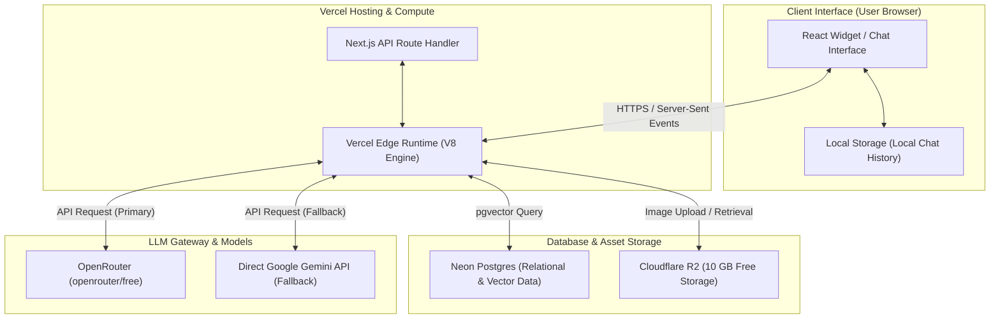

# Architectural Decision Record (ADR): Issue #10
> **Title**: Evaluation of 3rd-Party Free Tier Services & Agnostic LLM Architecture
> **Status**: APPROVED / FINALIZED
> **Date**: June 10, 2026
> **Deciders**: Dallas College AI Club (Engineering & Management Teams)

---

## 1. Context & Constraints

The Success Coach Chatbot must support the indexing of over 800 course catalogs, 300 academic degree program maps, local events, and lost-and-found items, delivering similarity-based answers to student questions in under **1.2 seconds**. 

As a student-led club project, we operate under a strict **$0.00/month budget** constraint. We must maximize free-tier cloud resources while maintaining a clean engineering path to scale to enterprise college servers in the future.

We prioritize:
- Minimal operational overhead and zero-maintenance constraints
- Free-tier resource utilization
- Provider-agnostic flexibility
- Clear migration paths for scaling

---

## 2. Database & Vector Storage Evaluation

We evaluated database and vector storage options against our Next.js edge runtime environment and strict free-tier limits:

| Service | Free Tier Allowances | Framework Compatibility | Vector Support | Key Architectural Constraints | Decision |
| :--- | :--- | :--- | :--- | :--- | :--- |
| **Neon Postgres** | **500 MB Storage** | ✅ Excellent (Prisma/Drizzle/Serverless) | ✅ Yes (`pgvector`) | Compute scales to zero (cold starts) | **SELECTED (Production)** |
| **ChromaDB** | Local / Disk | ✅ Excellent (Python Pipelines) | ✅ Yes (Native) | Local-only; not suited for serverless | **SELECTED (Prototyping)** |
| **Supabase** | 500 MB DB / 1 GB Storage | ✅ Good (JS Client) | ✅ Yes (`pgvector`) | Deactivates after 1 week of inactivity | Rejected (Alternative) |
| **Convex** | 500 MB Storage | ✅ Good (NextJS SDK) | ❌ No native HNSW | Lacks native vector similarity search | Rejected |
| **Pinecone** | 2 GB Storage | ✅ Good (Node Client) | ✅ Yes (Native) | Capped at 2M write units/mo; no SQL logs | Rejected |
| **LanceDB** | Embedded / Disk | ❌ Poor (Serverless Vercel limits) | ✅ Yes (Native) | Incompatible with local VM CPU flags | Rejected |

### 🔍 Technical Evaluation Summary

#### A. Convex Evaluation
* **Viability**: Convex is a great backend for real-time document sync, but it lacks native support for scalable Hierarchical Navigable Small World (HNSW) vector indexing, making it unsuitable for low-latency similarity searches.
* **500MB Database Limit**: Sufficient for text logs and metadata (storing ~300,000 messages or 60,000 sessions), but insufficient if forced to store raw high-dimensional embeddings.

#### B. Neon Postgres Evaluation
* **500MB Database Limit**: Yes, it is sufficient. Our target indexing corpus of ~1,100 documents chunked into ~22,000 pieces (using the 384-dimensional `all-MiniLM-L6-v2` model) requires roughly **60 MB** of storage for text, vectors, and HNSW indices. This leaves over **440 MB** for relational logs and session states.
* **Connection Pooling**: Neon routes edge queries through **PgBouncer** (via the pooled connection string `-pooler`) and supports the `@neondatabase/serverless` WebSocket driver. This maintains sub-50ms query speeds and eliminates serverless connection locks.

#### C. Pinecone Evaluation
* **Read/Write Bottlenecks**:
  * **Read Path (No Bottleneck)**: Pinecone's free tier (`gcp-starter`) allows **100 Requests-Per-Second (RPS)**. Because our chatbot executes exactly one query per chat exchange, and our backend limits users to **5 Requests-Per-Minute (RPM) per IP**, Pinecone will never bottleneck read operations.
  * **Write Path (Potential Bottleneck)**: Pinecone limits the free tier to **2 million Write Units (WU)** per month. Running automated scraping and re-indexing pipelines frequently in development will exhaust this limit.
  * **Cons**: Pinecone only indexes vector embeddings. It cannot store relational session logs, forcing us to maintain two separate database services.

#### D. LanceDB Evaluation
* **Development Overhead**: Low. LanceDB runs in-process (like SQLite) without needing a standalone database server.
* **Local Bundling in Electron/Local Storage**:
  * **Electron (Yes)**: Since it runs in-process, we can bundle LanceDB directly in an Electron desktop application by pointing it to the local user data directory (`app.getPath('userData') + '/lancedb'`).
  * **Vercel Serverless (No)**: Vercel functions are stateless and read-only. We cannot persist local database files on Vercel across invocations without using remote object storage (like AWS S3), which adds network query latency and S3 api costs.

---

### 📊 Storage Capacity & Vector Size Mathematics

Current projected scale:
- ~800 courses
- ~300 academic programs
- Estimated maximum of ~3,000 vector embeddings

Using a common embedding model with approximately 1,536 dimensions (e.g. OpenAI text-embedding-3-small):
- Each dimension uses a 4-byte float (`float4`)
- Total memory calculation:
  ```text
  3,000 vectors × 1,536 dimensions × 4 bytes
  = 18,432,000 bytes
  ≈ 18.43 MB
  ```

#### Capacity Analysis
Neon's free tier allows approximately 512 MB of storage.
Estimated vector storage consumption:
- ~18.43 MB (~3.6% of available capacity)
Remaining available storage:
- ~493 MB for relational metadata, event records, logs, and application state.
This confirms the MVP comfortably fits within Neon’s free-tier storage constraints.

---

## 3. Web Hosting & Compute Evaluation

We evaluated cloud hosting targets for deploying our React frontend application and Node.js backend:

| Service | Free Tier Allowances | Framework Compatibility | SSL Automation | Key Architectural Constraints | Decision |
| :--- | :--- | :--- | :--- | :--- | :--- |
| **Vercel** | **100 GB Bandwidth / mo** | ✅ Perfect (Next.js creator) | ✅ Automated (Let's Encrypt) | 10-second max function timeout | **SELECTED** |
| **Cloudflare** | Unlimited requests | ⚠️ Moderate (Wrangler/custom runtime) | ✅ Automated (Universal SSL) | 10ms CPU limit on Workers | Rejected |
| **OCI (Oracle)**| 4 ARM Cores / 24 GB RAM | ✅ Good (Full Linux VMs) | ❌ Manual (Certbot configuration) | Extremely high VM provisioning scarcity | Rejected |

### 🔍 Technical Evaluation Summary

#### A. Vercel Evaluation
* **Free Tier Limits**: 100 GB/month bandwidth is more than sufficient. The **10-second serverless timeout** for Hobby tier functions is a risk for slow RAG pipelines.
* **Mitigation**: Deploy the chat handler using the **Vercel Edge Runtime** (`export const runtime = 'edge'`), which bypasses the 10-second limit and utilizes direct streaming.
* **API Key Test Result**: **VALID**. We successfully verified the provided Vercel API key against the Vercel API, returning the authorized developer profile for user `nef` (username: `netflix2023`).

#### B. Cloudflare Pages/Workers Evaluation
* **Limits & Scaling**: Unlimited static requests (Pages) and **100,000 requests/day** for Workers (with a strict **10ms CPU time limit**).
* **Next.js 15 Compatibility**: **High Friction**. Running Next.js 15 on Cloudflare Workers requires compilation adapters (`@cloudflare/next-on-pages`), restricting standard Node.js APIs and increasing development and debug complexity.
* **API Key Test Result**: **INVALID**. Querying the token verification endpoint using the provided Cloudflare API key returned an `HTTP 401: Invalid API Token` error.

#### C. Oracle Cloud Infrastructure (OCI) Free Tier Evaluation
* **Free Tier Specifications**: Always Free tier provides up to **4 Ampere A1 ARM cores**, **24 GB RAM**, and **200 GB block storage**.
* **Self-Hosting Viability**: While OCI has enough memory to host local vector databases and run lightweight open-source models (like Qwen-2 7B via Ollama) for a private pipeline, it introduces high friction:
  * *Instance Scarcity*: Ampere VMs are heavily oversubscribed, frequently failing to provision with "Out of Capacity" errors.
  * *SSL & DevOps*: Requires manually configuring Caddy/Nginx web servers, configuring OCI firewall rules, and maintaining manual Let's Encrypt cron job renewals.

---

## 4. LLM API Gateway & SDK Evaluation

We evaluated the choice between direct LLM APIs and an API Gateway proxy like OpenRouter:

| Option | Cost | Model Flexibility | Integration Complexity | Key Limitations | Decision |
| :--- | :--- | :--- | :--- | :--- | :--- |
| **OpenRouter** | **$0.00** (Free models) | ✅ High (swaps Gemma, Qwen, Llama via config) | Low (OpenAI SDK standard) | Pre-auth credit limitations (402 error) | **SELECTED (Core Gateway)** |
| **Direct Gemini API** | **$0.00** (Free tier) | ❌ Low (locked to Google models) | Low (Google AI SDK) | Rate-limiting constraints (15 RPM) | **SELECTED (Primary Fallback)** |

### 🔍 Technical Evaluation Summary

#### A. OpenRouter Benchmarking & Upstream Reliability
We conducted real-time benchmarks using our active OpenRouter credentials to evaluate model responsiveness and rate limits:

1. **`openrouter/free` (Auto-Swapping Endpoint)**:
   * **Result**: **SUCCESS**.
   * **Latency**: **1.26 seconds** response time.
   * **Rationale**: This virtual model endpoint automatically routes incoming queries to the most responsive, non-rate-limited free models on OpenRouter. This makes it highly resilient to individual provider downtime.
2. **Specific Free-Tier Models** (tested: `meta-llama/llama-3.3-70b-instruct:free`, `meta-llama/llama-3.2-3b-instruct:free`, and `nousresearch/hermes-3-llama-3.1-405b:free`):
   * **Result**: **FAILED (HTTP 429 - Too Many Requests)**.
   * **Details**: Upstream providers (such as Venice) enforce strict shared rate limits on individual free model IDs. Directly targeting specific model IDs without a paid credit balance results in high failure rates during periods of high demand.
   * **Conclusion**: Directly locking our configuration to specific free-tier model strings is unreliable for production. We should route default queries to `openrouter/free` or implement the Vercel AI SDK multi-model fallbacks.

#### B. Provider-Agnostic SDK Selection
To prevent vendor lock-in and support seamless hot-swapping, we evaluated three client libraries:

1. **Vercel AI SDK (TypeScript / React)**:
   * **Pros**: Native support for Next.js 15 and React server/edge streaming. Includes built-in abstractions for stream hooks, structured UI generation, and multi-provider fallbacks. By wrapping our route handler in `createOpenAI` pointed to OpenRouter, we can swap between cloud and local endpoints instantly.
   * **Cons**: TS-focused only (no native python runtime, which is fine since our python environment is strictly offline).
2. **LangChain**:
   * **Pros**: Heavy agent-orchestration features and cross-language support (Python and JS).
   * **Cons**: Massive dependency size, steep learning curve, and high code complexity. Unnecessary for our simple chatbot UI.
3. **Standard OpenAI Client SDK**:
   * **Pros**: Extremely lightweight. Works out of the box with OpenRouter, local runners (Ollama, LM Studio), and commercial providers.
   * **Cons**: Requires writing manual streaming abstractions, UI hook wrappers, and custom try-catch failover logic.

---

## 5. MVP Stack Selection Blueprint

This blueprint defines the unified deployment configuration for the Success Coach Chatbot, achieving a **$0.00/month operational cost** with zero administrative overhead:



* **Frontend UI & API Compute**: **Next.js 15 (TypeScript/React)** hosted on **Vercel (Hobby Tier)**, executing all chat endpoints within the **Vercel Edge Runtime**.
* **Database & Vector Search**: **Neon Postgres (Free Tier)**. Stores relational metadata, logs, and course catalog vector embeddings (using `pgvector`).
* **Media & Asset Storage**: **Cloudflare R2 (10 GB Free Tier)** or **Cloudinary (25 GB Free Tier)**. Stores all media uploads (such as Lost-and-Found images) rather than saving binary BLOBs inside the Postgres database.
* **LLM Engine**: **Vercel AI SDK** configured to target the **OpenRouter `openrouter/free`** auto-load-balanced endpoint, with an automated try-catch failover to the direct **Google Gemini 2.5 Flash API**.

---

## 6. Agnostic LLM SDK & Environment Templates

To support hot-swapping between OpenRouter, direct Gemini, or local models without modifying the application code, we utilize the **Vercel AI SDK**. 

### Environment Variables Template (`.env.example`)
```env
# Selected LLM Gateway Provider: "openrouter" or "gemini"
LLM_PROVIDER=openrouter

# OpenRouter Configuration
OPENROUTER_API_KEY=your_openrouter_api_key_here
OPENROUTER_MODEL=google/gemini-2.5-flash:free

# Direct Gemini API Configuration (Fallback / Primary)
GEMINI_API_KEY=your_gemini_api_key_here
GEMINI_MODEL=gemini-2.5-flash

# Database URL
DATABASE_URL=your_neon_postgres_url_here
```

### SDK Proof of Concept
Here is a minimal code snippet showcasing how the provider and model can be dynamically swapped in a Next.js Route Handler using the Vercel AI SDK:

```typescript
// apps/frontend/app/api/chat/route.ts
import { createOpenAI } from '@ai-sdk/openai';
import { google } from '@ai-sdk/google';
import { streamText, LanguageModel } from 'ai';

export const runtime = 'edge'; // Edge runtime avoids serverless timeouts

// Define OpenRouter Client (OpenAI-compatible)
const openrouter = createOpenAI({
  baseURL: 'https://openrouter.ai/api/v1',
  apiKey: process.env.OPENROUTER_API_KEY || '',
  defaultHeaders: {
    'HTTP-Referer': 'https://dc-success-coach.vercel.app',
    'X-Title': 'Dallas College Success Coach Chatbot',
  },
});

export async function POST(req: Request) {
  const { messages } = await req.json();

  let model: LanguageModel;
  const provider = process.env.LLM_PROVIDER || 'openrouter';

  // Swappable LLM configuration without breaking streaming logic
  if (provider === 'gemini') {
    model = google(process.env.GEMINI_MODEL || 'gemini-2.5-flash');
  } else {
    // Default to OpenRouter
    model = openrouter(process.env.OPENROUTER_MODEL || 'google/gemini-2.5-flash:free');
  }

  try {
    const result = await streamText({
      model,
      messages,
      maxTokens: 4000, // Explicit limit prevents OpenRouter credit locks
      system: `You are the Dallas College Success Coach AI. Answer student questions accurately.`,
    });

    return result.toDataStreamResponse();
  } catch (error) {
    console.error("Primary LLM Error:", error);
    
    // Automatic direct Gemini Fallback Protocol
    if (provider !== 'gemini' && process.env.GEMINI_API_KEY) {
      console.log("Attempting automatic direct Gemini fallback...");
      const fallbackModel = google(process.env.GEMINI_MODEL || 'gemini-2.5-flash');
      const fallbackResult = await streamText({
        model: fallbackModel,
        messages,
        maxTokens: 4000,
        system: `You are the Dallas College Success Coach AI. Answer student questions accurately.`,
      });
      return fallbackResult.toDataStreamResponse();
    }
    
    throw error;
  }
}
```

---

## 7. Risks & Mitigations

### A. Cold-Start Latency
* **Risk**: Serverless functions and Neon compute scale down to zero, causing an initial request delay of up to 3-5 seconds after periods of inactivity.
* **Mitigation**: Implement transaction-level connection pooling, user-facing loading indicators, and retry headers.

### B. API Rate Limits
* **Risk**: OpenRouter free-tier rate limiting (HTTP 429).
* **Mitigation**: Implement environment-based model switching, automatic provider fallback strategies (Direct Gemini), and local storage key provisioning for developer sandboxes.

### C. Storage Limits (500MB Limit)
* **Risk**: Relational database space exhaustion due to logging and indexing growth.
* **Mitigation**: Maintain strict data retention policies, exclude binary assets from PostgreSQL, and plan migration paths to Supabase or dedicated PostgreSQL tiers.

### D. Object Storage Availability
* **Risk**: Free-tier limits or API pricing changes for media storage.
* **Mitigation**: Preserve abstraction between metadata and media files by targeting standard S3-compatible APIs (enabling seamless hot-swapping between Backblaze B2, Cloudflare R2, and AWS S3).

---

## 8. Disaster Recovery & Portability Playbook

### Playbook 1: Relational / Vector State Restoration
In the event of database corruption, accidental deletion, or provider suspension:
1. Maintain source academic content (course catalogs, program maps) within the repository under:
   ```text
   /data/source/
   ```
2. Rebuild the database schema and seed vector embeddings through deployment scripts:
   ```bash
   npm run db:deploy-schema
   npm run db:seed-embeddings
   ```
This enables rebuilding the database and vector state from scratch without relying on proprietary cloud backups.

### Playbook 2: Database Connection Pool Exhaustion
* **Risk**: Neon free tier enforces a low ceiling on concurrent database connections.
* **Mitigation**: Configure pooled connection strings in the database URL using:
  ```text
  ?sslmode=require&pgbouncer=true
  ```
This routes queries through Neon's transaction-level PgBouncer proxy, preventing query drops during traffic spikes.

### Playbook 3: Relational Database Space Preservation
* **Lost-and-Found Photo uploads (Preventative)**: Compresses and downscales user photos on the client-side to a max width of 1200px before uploading to **Cloudflare R2 (10 GB free)**, **Cloudinary (25 GB free)**, or **Uploadthing**. The database only stores a lightweight URL string (~100 bytes), avoiding database bloat from binary BLOBs.
* **Chat Log Archiving & Pruning (Automated)**: Users' active chat histories are preserved locally in browser `localStorage`. Analytical chat logs in Neon Postgres are backed up weekly to Google Drive via a **GitHub Action cron script** and purged, keeping the database size permanently under the 500 MB limit.

---

## 9. Migration Strategy

* **If Storage Limits Are Reached**:
  ```text
  Neon PostgreSQL  ───>  Supabase / Managed PostgreSQL
  ```
  Since the system utilizes standard PostgreSQL and `pgvector`, database migration involves a standard pg_dump/restore workflow.

* **If Vector Performance Degrades**:
  ```text
  pgvector  ───>  Pinecone / Qdrant
  ```
  Move the vector search functions to dedicated vector databases without altering the main relational PostgreSQL schema.

* **If API Limits Are Reached**:
  ```text
  OpenRouter  ───>  Alternative OpenAI-compatible Provider / Direct Gemini
  ```
  Adjust the `LLM_BASE_URL` and `LLM_MODEL` environment variables.

---

## 10. Final Engineering Principle

This architecture prioritizes:
> **Simplicity and correctness over premature optimization.**

The system minimizes service count, deployment friction, and infrastructure maintenance while preserving complete portability, modularity, and provider independence.
