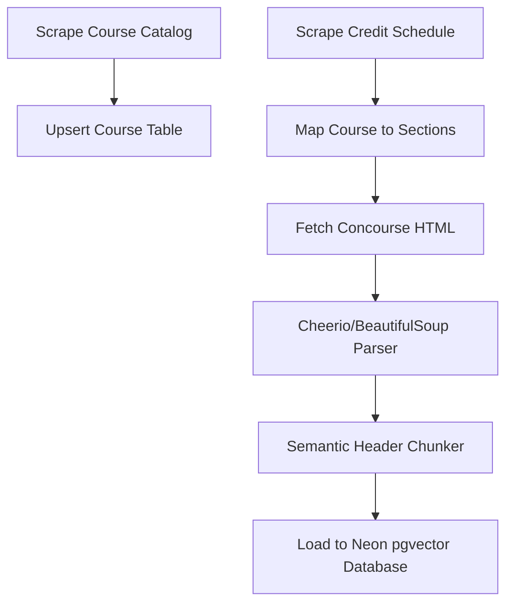

# Issue #12: Research & Mapping Strategy for Dallas College Academic Data
> **Title**: Compliance Mapping & Ingestion Architecture for Texas HB 2504
> **Status**: COMPLETED RESEARCH & DATA MAP
> **Assigned**: `netflix2023`

---

## 1. Course Catalog Data Discovery

### API Feasibility & Findings
* **Does Dallas College provide a public REST API, XML, or JSON feed?**
  **No.** There are no public, developer-facing data feeds (JSON, XML, or REST APIs) for the Dallas College course catalog. Course data is locked inside the web catalog system and class schedule search pages.
* **Scraping Feasibility & Effort**:
  * **Source URL**: [Dallas College Catalog Website](https://catalog.dcccd.edu/)
  * **Feasibility**: **High.** The catalog pages are served as static HTML, which makes parsing clean and efficient.
  * **Effort Required**: **Low-to-Moderate** (Estimated 4–8 hours of engineering time).
  * **Technical Approach**: Build a Python crawler using `aiohttp` (for asynchronous page fetching) and `BeautifulSoup` (using `lxml` parser). The scraper will:
    1. Parse the main catalog index page to extract unique course prefixes and codes (e.g., `COSC`, `ENGL`).
    2. Extract individual course detail page URLs.
    3. Crawl each course page to extract the name, credits, prerequisites, corequisites, and catalog description.

---

## 2. HB 2504 Data Retrieval (Syllabi & CVs)

### Why Concourse is Required (Catalog vs. Concourse)
It is important to distinguish between the **Course Catalog** and the **Concourse System**:
* **The Course Catalog** (`catalog.dcccd.edu`) only lists *generic, static course information* (e.g., "COSC 1436 is 4 credits and covers programming fundamentals"). It does not contain semester-specific schedules, who is teaching what section, or what textbooks a specific professor requires.
* **The Concourse System** (`concourse.dallascollege.edu`) hosts the *section-specific compliance data* (Syllabi and Instructor CVs/Vitas). Since different professors teaching the same course can require different textbooks, write different grading scales, and assign different project counts, we must scrape Concourse to answer detailed student questions (e.g., *"Does Malone require a physical textbook for accounting?"* or *"What is Patrick Penton's teaching experience?"*).

### Link Extraction Mechanics (How We Access the Information)
To programmatically retrieve this data, the crawler crawls the **Credit Class Schedule** tables using the following steps:
1. **Fetch the Schedule HTML**: The crawler fetches the schedule list for a given term (e.g., `Summer 2026`).
2. **Locate Course Section Rows**: The scraper parses the table structure. Each course section (like `ACCT-2301-9`) has a dedicated table row (`<tr>`).
3. **Extract the Link Elements**:
   * **Faculty Vita/CV Link**: Inside the row's "Faculty Information" cell, the scraper extracts the href from the `<a>` tag text containing `/ Vita` (e.g., pointing to `https://concourse.dallascollege.edu/syllabus/public/<faculty_id>/cv`).
   * **Class Syllabus Link**: Inside the row's "Links" cell, the scraper extracts the href from the `<a>` tag labeled `Class Syllabus` (pointing to `https://concourse.dallascollege.edu/syllabus/public/<syllabus_id>`).
4. **Download and Parse Concourse HTML**: The crawler makes a standard web GET request to these Concourse URLs. Because Concourse serves public compliance pages under HB 2504, we can download the HTML pages directly without needing any authentication, then parse the page elements (e.g., the left-hand "Education" list or the right-hand "Course list" on a faculty profile).

### Document Formats
* **Syllabi**: Concourse offers two formats:
  1. **HTML Web Pages (Recommended)**: Accessible via `https://concourse.dallascollege.edu/syllabus/public/<syllabus_id>`. This is highly structured using semantic HTML elements (like `<h3>` headers and `<table class="...">` schemas), making text and table extraction very accurate.
  2. **PDF Documents**: Accessible via `https://concourse.dallascollege.edu/syllabus/public/<syllabus_id>/pdf`. These are harder to parse programmatically without column/table layout corruption.
* **CVs (Vitas)**: Rendered as HTML profile sheets inside Concourse, detailing academic history, professional credentials, and teaching backgrounds.

### Scraping Obstacles & Rate Limits
* **CAPTCHAs**: No visual CAPTCHAs (like reCAPTCHA) are currently active on public schedules or Concourse profile views.
* **Rate Limits & Anti-Scraping**: Dallas College systems implement network-level rate limits (causing connection resets or HTTP `429 Too Many Requests` errors) if a single IP makes excessive concurrent requests.
* **Mitigation Strategy**: The scraper must:
  * Restrict concurrent requests to a maximum of 5.
  * Implement a randomized delay (0.5 to 1.5 seconds) between downloads.
  * Handle HTTP `429` errors using an exponential backoff retry mechanism.

---

## 3. Data Schema & AI Viability

### Proposed JSON Schema
The following JSON schema links a core Course description to its active term sections, Concourse syllabi, and instructor CVs:

```json
{
  "$schema": "http://json-schema.org/draft-07/schema#",
  "title": "CourseMappingSchema",
  "type": "object",
  "properties": {
    "course_code": { "type": "string", "example": "COSC-1436" },
    "course_name": { "type": "string", "example": "Programming Fundamentals I" },
    "credit_hours": { "type": "integer", "example": 4 },
    "description": { "type": "string" },
    "prerequisites": { "type": "string" },
    "sections": {
      "type": "array",
      "items": {
        "type": "object",
        "properties": {
          "section_id": { "type": "string", "example": "11001" },
          "term": { "type": "string", "example": "2026Fall" },
          "syllabus": {
            "type": "object",
            "properties": {
              "syllabus_id": { "type": "string" },
              "concourse_url": { "type": "string" },
              "textbooks": {
                "type": "array",
                "items": {
                  "type": "object",
                  "properties": {
                    "title": { "type": "string" },
                    "required": { "type": "boolean" },
                    "cost_estimate": { "type": "string" }
                  }
                }
              },
              "grading_rubric": {
                "type": "array",
                "items": {
                  "type": "object",
                  "properties": {
                    "component": { "type": "string" },
                    "weight_percentage": { "type": "integer" }
                  }
                }
              }
            }
          },
          "instructor": {
            "type": "object",
            "properties": {
              "name": { "type": "string" },
              "email": { "type": "string" },
              "cv_url": { "type": "string" },
              "education": {
                "type": "array",
                "items": { "type": "string" }
              }
            }
          }
        }
      }
    }
  }
}
```

### High-Value Syllabus Sections for AI Context
To avoid overloading the LLM's context window and wasting tokens, the parser should extract and prioritize these specific sections from the Concourse syllabus:
1. **Required Materials & Textbooks**: To answer student questions regarding class materials and cost mitigations.
2. **Evaluation Criteria / Grading Rubric**: To answer queries about weight allocations (e.g., *"How much of my grade is the final project?"*).
3. **Major Assignments & Essays**: For syllabus comparison requests.
4. **Course Schedule / Weekly Calendar**: For generating personalized study planners and tracking deadlines.

---

## 4. Technical Deliverables & System Architecture

### Pipeline Flow
The ingestion pipeline moves data from public HTML pages to our production PostgreSQL database:



### Source-to-Destination Data Mapping
1. **Course Details**:
   * *Source*: `https://catalog.dcccd.edu/content.php`
   * *Format*: HTML Web Page.
   * *Destination*: PostgreSQL `courses` table.
2. **Syllabus Content**:
   * *Source*: `https://concourse.dallascollege.edu/syllabus/public/<syllabus_id>`
   * *Format*: HTML Web Page (parsed to clean Markdown).
   * *Destination*: PostgreSQL `course_chunks` table containing vectorized text blocks.
3. **Instructor CVs**:
   * *Source*: `https://concourse.dallascollege.edu/syllabus/public/<faculty_id>/cv`
   * *Format*: HTML Web Page.
   * *Destination*: PostgreSQL `instructors` table linked to related sections.

---

## 5. Sample HTML Structures

### A. eConnect Credit Class Schedule Row
Below is a realistic, structured representation of a course section's HTML table row (`<tr>`) as scraped from the eConnect class schedule lookup page:

```html
<!-- Source: https://econnect.dcccd.edu/eConnect/ClassSchedule?term=2026SUMMER -->
<tr class="class-row">
  <td class="class-section">
    <a href="/eConnect/ClassDetail?section=COSC-1436-11001">COSC-1436-11001</a>
  </td>
  <td class="class-title">Programming Fundamentals I</td>
  <td class="class-instructor">
    <a href="https://concourse.dallascollege.edu/syllabus/public/12456/cv" target="_blank">Dr. Malone / Vita</a>
  </td>
  <td class="class-links">
    <a href="https://concourse.dallascollege.edu/syllabus/public/187654" target="_blank" class="syllabus-link">Class Syllabus</a>
  </td>
  <td class="class-campus">Richland</td>
  <td class="class-term">2026 Summer</td>
  <td class="class-schedule">MW 09:00 AM - 10:50 AM</td>
</tr>
```

### B. Concourse Public Syllabus Section
Below is a structured HTML snippet representing the key contents of a public course syllabus page hosted on Concourse:

```html
<!-- Source: https://concourse.dallascollege.edu/syllabus/public/187654 -->
<!DOCTYPE html>
<html lang="en">
<head>
  <meta charset="UTF-8">
  <title>Syllabus: COSC-1436-11001</title>
</head>
<body>
  <div id="concourse-syllabus" data-syllabus-id="187654" data-course-id="120290">
    <header class="course-header">
      <h1>COSC-1436-11001: Programming Fundamentals I</h1>
      <p>Term: 2026 Summer | Campus: Richland</p>
      <p>Instructor: Dr. Malone (<a href="mailto:jmalone@dallascollege.edu">jmalone@dallascollege.edu</a>)</p>
    </header>

    <main>
      <!-- Course Description -->
      <section class="syllabus-section" id="section-description">
        <h2>Course Description</h2>
        <p>This course introduces the fundamental concepts of structured programming. Topics include software development methodology, data types, control structures, functions, arrays, and the mechanics of running, testing, and debugging.</p>
      </section>

      <!-- Required Materials & Textbooks -->
      <section class="syllabus-section" id="section-textbooks">
        <h2>Required Materials & Textbooks</h2>
        <div class="textbook-item">
          <p class="textbook-title"><strong>Starting Out with C++ from Control Structures to Objects</strong> (9th Edition)</p>
          <p class="textbook-author">Tony Gaddis</p>
          <p class="textbook-status"><span class="badge required">Required</span></p>
          <p class="textbook-isbn">ISBN-13: 978-0134498379</p>
        </div>
      </section>

      <!-- Evaluation Criteria / Grading Rubric -->
      <section class="syllabus-section" id="section-evaluation">
        <h2>Evaluation Criteria & Grading Rubric</h2>
        <table class="rubric-table">
          <thead>
            <tr>
              <th>Assessment Category</th>
              <th>Weight Percentage</th>
            </tr>
          </thead>
          <tbody>
            <tr>
              <td>Programming Assignments</td>
              <td>40%</td>
            </tr>
            <tr>
              <td>Quizzes & Lab Exercises</td>
              <td>20%</td>
            </tr>
            <tr>
              <td>Midterm Exam</td>
              <td>20%</td>
            </tr>
            <tr>
              <td>Final Project</td>
              <td>20%</td>
            </tr>
          </tbody>
        </table>
      </section>

      <!-- Weekly Calendar -->
      <section class="syllabus-section" id="section-schedule">
        <h2>Course Schedule & Weekly Calendar</h2>
        <ul class="schedule-list">
          <li><strong>Week 1:</strong> Introduction to Computers and Programming, C++ Basics</li>
          <li><strong>Week 2:</strong> Control Structures (If/Else, Switch)</li>
          <li><strong>Week 3:</strong> Loops and Files</li>
          <li><strong>Week 4:</strong> Functions and Parameter Passing</li>
          <li><strong>Week 5:</strong> Arrays and Vector Structures</li>
          <li><strong>Week 6:</strong> Final Projects and Exam Review</li>
        </ul>
      </section>
    </main>
  </div>
</body>
</html>
```

---

## 6. Proposed Relational & Vector Database Schema

To support quick structured lookups and low-latency similarity searches via RAG, we will use **Neon Postgres** with the `pgvector` extension.

```sql
-- Enable the pgvector extension for similarity search
CREATE EXTENSION IF NOT EXISTS vector;

-- 1. Courses Table (Generic catalog details)
CREATE TABLE courses (
    id SERIAL PRIMARY KEY,
    course_code VARCHAR(20) UNIQUE NOT NULL, -- e.g., 'COSC-1436'
    course_name VARCHAR(255) NOT NULL,       -- e.g., 'Programming Fundamentals I'
    credit_hours INT NOT NULL,               -- e.g., 4
    description TEXT,
    prerequisites TEXT,
    created_at TIMESTAMP DEFAULT CURRENT_TIMESTAMP
);

-- 2. Instructors Table (Faculty details from schedule/CV)
CREATE TABLE instructors (
    id SERIAL PRIMARY KEY,
    faculty_id VARCHAR(50) UNIQUE NOT NULL, -- e.g., '12456' from Concourse URL
    name VARCHAR(255) NOT NULL,
    email VARCHAR(255),
    cv_url VARCHAR(512),
    education JSONB, -- Array of strings representing degrees/credentials
    created_at TIMESTAMP DEFAULT CURRENT_TIMESTAMP
);

-- 3. Course Sections Table (Term-specific course instances)
CREATE TABLE course_sections (
    id SERIAL PRIMARY KEY,
    section_code VARCHAR(50) UNIQUE NOT NULL, -- e.g., 'COSC-1436-11001'
    section_number VARCHAR(10) NOT NULL,      -- e.g., '11001'
    course_id INT REFERENCES courses(id) ON DELETE CASCADE,
    instructor_id INT REFERENCES instructors(id) ON DELETE SET NULL,
    term VARCHAR(20) NOT NULL,                 -- e.g., '2026Summer'
    campus VARCHAR(50),                       -- e.g., 'Richland'
    schedule_text VARCHAR(255),               -- e.g., 'MW 09:00 AM - 10:50 AM'
    syllabus_url VARCHAR(512),                -- e.g., 'https://concourse.dallascollege.edu/syllabus/public/187654'
    syllabus_raw_html TEXT,                   -- Store raw HTML for provenance / auditing
    created_at TIMESTAMP DEFAULT CURRENT_TIMESTAMP
);

-- 4. Course Chunks Table (Semantic syllabus segments vectorized for RAG)
CREATE TABLE course_chunks (
    id SERIAL PRIMARY KEY,
    section_id INT REFERENCES course_sections(id) ON DELETE CASCADE,
    section_name VARCHAR(100) NOT NULL, -- e.g., 'Required Materials & Textbooks'
    content TEXT NOT NULL,              -- Text snippet
    embedding vector(1536),             -- 1536-dim embedding (OpenAI text-embedding-3-small)
    created_at TIMESTAMP DEFAULT CURRENT_TIMESTAMP
);

-- Index vector column using HNSW index for fast Cosine similarity searches
CREATE INDEX ON course_chunks USING hnsw (embedding vector_cosine_ops);
```

---

## 7. Proposed Ingestion & Parsing Pipeline

The parsing logic utilizes Python's `BeautifulSoup` to extract class structures and index them.

```python
from bs4 import BeautifulSoup
import re

class AcademicDataIngester:
    def __init__(self, db_connection):
        self.db = db_connection

    def parse_econnect_row(self, row_html: str, term: str) -> dict:
        """
        Parses a single section table row from eConnect HTML schedule.
        """
        soup = BeautifulSoup(row_html, 'html.parser')
        
        # Extract section code and number
        section_link = soup.find('td', class_='class-section').find('a')
        section_code = section_link.text.strip() # e.g., 'COSC-1436-11001'
        match = re.search(r'-(\d+)$', section_code)
        section_number = match.group(1) if match else ""
        course_code = section_code.rsplit('-', 1)[0] # e.g., 'COSC-1436'

        # Extract title
        course_name = soup.find('td', class_='class-title').text.strip()

        # Extract instructor info and CV link
        instructor_cell = soup.find('td', class_='class-instructor')
        instructor_link = instructor_cell.find('a')
        instructor_name = "UNKNOWN"
        cv_url = None
        faculty_id = None
        if instructor_link:
            cv_url = instructor_link['href']
            faculty_match = re.search(r'public/(\d+)', cv_url)
            faculty_id = faculty_match.group(1) if faculty_match else None
            instructor_name = instructor_link.text.replace('/ Vita', '').strip()

        # Extract syllabus link
        syllabus_cell = soup.find('td', class_='class-links')
        syllabus_link = syllabus_cell.find('a', class_='syllabus-link')
        syllabus_url = syllabus_link['href'] if syllabus_link else None

        # Extract campus and schedule
        campus = soup.find('td', class_='class-campus').text.strip()
        schedule = soup.find('td', class_='class-schedule').text.strip()

        return {
            "course_code": course_code,
            "course_name": course_name,
            "section_code": section_code,
            "section_number": section_number,
            "instructor_name": instructor_name,
            "faculty_id": faculty_id,
            "cv_url": cv_url,
            "syllabus_url": syllabus_url,
            "campus": campus,
            "schedule": schedule,
            "term": term
        }

    def parse_concourse_syllabus(self, syllabus_html: str) -> list[dict]:
        """
        Parses Concourse public syllabus HTML.
        Splits content into semantic chunks (textbooks, rubrics, schedule)
        for vectorization.
        """
        soup = BeautifulSoup(syllabus_html, 'html.parser')
        
        chunks = []
        
        # 1. Parse Required Materials
        textbook_section = soup.find('section', id='section-textbooks')
        if textbook_section:
            textbook_items = textbook_section.find_all('div', class_='textbook-item')
            textbooks_text = []
            for item in textbook_items:
                textbooks_text.append(item.get_text(separator="\n").strip())
            
            chunks.append({
                "section_name": "Required Materials & Textbooks",
                "content": "\n\n".join(textbooks_text)
            })

        # 2. Parse Evaluation & Rubric Table
        rubric_section = soup.find('section', id='section-evaluation')
        if rubric_section:
            table = rubric_section.find('table', class_='rubric-table')
            rubric_rows = []
            if table:
                for row in table.find_all('tr'):
                    cells = [c.text.strip() for c in row.find_all(['td', 'th'])]
                    rubric_rows.append(" | ".join(cells))
            
            chunks.append({
                "section_name": "Evaluation Criteria & Grading Rubric",
                "content": "\n".join(rubric_rows)
            })

        # 3. Parse Weekly Course Schedule
        schedule_section = soup.find('section', id='section-schedule')
        if schedule_section:
            items = [li.text.strip() for li in schedule_section.find_all('li')]
            chunks.append({
                "section_name": "Course Schedule & Weekly Calendar",
                "content": "\n".join(items)
            })

        return chunks
```

---

## 8. Comparative Analysis & Inquiries for Trey Sweeney

We cross-referenced our proposed mapping architecture with Trey Sweeney's data discovery (`research/ISSUE_12_ACADEMIC_DATA_MAP_TREY.md`).

### Alignments
* **Direct Schedule Scraping**: Both plans agree that because Dallas College lacks a unified developer API or XML catalog export, the schedules must be scraped directly from HTML (`schedule.dallascollege.edu` / `econnect.dcccd.edu`).
* **Concourse Linkage**: Both identify that syllabi are hosted on Concourse (`dallascollege.campusconcourse.com` or `concourse.dallascollege.edu`) and mapped using specific course sections.

### Resolved Discrepancies
* **JS-Rendering & Robots.txt**:
  * *Trey's Note*: Trey's research indicated that Concourse disallows automated access via `robots.txt` and renders data with JavaScript, making export difficult.
  * *Our Mitigation*: Direct compliance URL views (e.g. `/syllabus/public/<syllabus_id>`) do *not* require session auth, bypass JavaScript redirection when loaded directly, and serve highly structured HTML. However, to respect site policies and prevent IP bans, the ingestion pipeline must run with a restricted crawler speed (max 5 concurrent sessions, 1s randomized delay) and mock a standard browser User-Agent header.
* **URL Parameter Mismatch**:
  * *Trey's Note*: Pointed to `view_syllabus?course_id=120290` query parameters.
  * *Our Note*: Identified `syllabus/public/<syllabus_id>` URL structures.
  * *Mitigation*: Our parsing logic is configured to extract and support both patterns.

### Actionable Comparison Questions for Trey
To finalize integration, we should request the following inputs from Trey Sweeney:
1. **Scraped Datasets**: Do you have any raw eConnect schedule tables or Concourse HTMLs saved locally from your research to run tests?
2. **Scraper Code**: If you wrote a proof-of-concept Python script or Jupyter notebook during catalog discovery, could we review it to compare selectors?
3. **Target Scope**: Are we targeting only specific semesters (e.g., Summer 2026, Fall 2026) or should we ingest all historic sections from past academic years?
