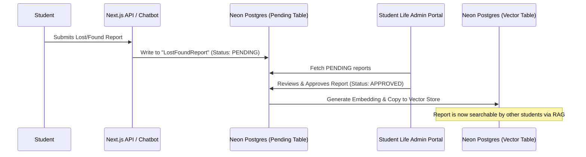

# Moderated Lost & Found Workflow: Technical Design (Issue #19)

This document evaluates the workflow, security protocols, and technical architecture for processing user-submitted "Lost & Found" reports in the chatbot MVP.

---

## 1. Moderation Architecture

To prevent spam, harassment, and security vulnerabilities (e.g. users claiming high-value items they did not lose), all user-submitted entries must pass through an administrative approval queue before becoming searchable by the RAG model.



---

## 2. Database Models

We define a dedicated Prisma model to track the moderation state and metadata of reports:

```prisma
enum ReportType {
  LOST
  FOUND
}

enum ModerationStatus {
  PENDING
  APPROVED
  REJECTED
  RESOLVED
}

model LostFoundReport {
  id               String           @id @default(uuid())
  type             ReportType
  itemCategory     String           // e.g., "Electronics", "Keys", "Books"
  description      String           @db.Text // User-provided description
  campus           String           // e.g., "Richland", "Brookhaven"
  locationDetails  String?          // e.g., "Sabine Hall Room S203"
  contactEmail     String           // Submitter's email
  status           ModerationStatus @default(PENDING)
  moderatorNotes   String?          @db.Text
  approvedAt       DateTime?
  createdAt        DateTime         @default(now())
  updatedAt        DateTime         @updatedAt
  
  // Vector representation (only populated once status is APPROVED)
  embedding        Unsupported("vector(384)")?
}
```

---

## 3. Moderation Rules & Security Protocols

To maintain campus safety, the moderation portal enforces the following policies:

1.  **High-Value Items Security**:
    *   Descriptions of items like wallets, credit cards, phones, and car keys are **censored/generalized**.
    *   *Example*: A student submits: *"Found car keys with a green Yoda keychain and red lanyard"*. 
    *   *Moderator Action*: The moderator edits the public description to: *"Found car keys on a lanyard"* and moves the specific details (green Yoda keychain) to `moderatorNotes` (hidden from vector search). This ensures only the true owner can describe the keychain to claim the keys.
2.  **Contact Privacy**:
    *   Student emails are **never embedded** in the vector store.
    *   The chatbot will never output the submitter's email. Instead, it instructs the user to visit the Office of Student Life and reference the Report ID.
3.  **Automatic Expiration**:
    *   To keep the vector index small and clean, a daily database trigger archives or deletes all reports older than **30 days** (`createdAt < CURRENT_DATE - INTERVAL '30 days'`).
