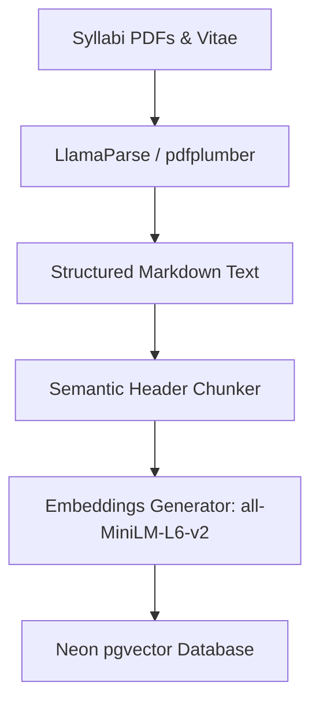

# Retrieval-Augmented Generation (RAG) Evaluation & Production Plan
> **Title**: RAG Pipeline Viability & Neon pgvector Integration Strategy
> **Status**: APPROVED RESEARCH & INTEGRATION PLAN
> **Target Issue**: #20
> **Deciders**: Neftali, Dallas College AI Club (Engineering Team)

---

## 1. Key Evaluation Summary

Before scraping thousands of PDFs and faculty CVs, we conducted a Retrieval-Augmented Generation (RAG) viability assessment to determine if a Large Language Model (LLM) can accurately understand, query, and reason over academic documents. Specifically, we tested course selection queries (e.g., grading policies, textbooks, essay requirements).

### 🎯 Key RAG Findings
1. **Document Parsing & Extraction**: Rule-based text extraction mangles tables. We require **layout-aware parsing** (e.g., `pdfplumber` or `LlamaParse`) that outputs structured Markdown (`|`) to maintain the integrity of rubrics and schedules.
2. **Chunking Strategy**: Recursive character chunking breaks logical blocks. We recommend **Semantic Header-Based Chunking** combined with **Metadata Enrichment** to track the course ID, professor, and section name.
3. **Search Viability**: Semantic search using local embeddings (`all-MiniLM-L6-v2`) successfully retrieves textbook and assignment information from academic documents and correctly answers prompts.
4. **Context Starvation Bug**: Global search history can cause details from one course to crowd out details from another on cross-course comparison queries. We resolve this in production using **Metadata Pre-Filtering** and **Course-Grouped Retrieval**.

---

## 2. Document Parsing & Extraction

Academic syllabi are highly tabular. We evaluated the following libraries on digital-born Dallas College syllabi to find the best tool to extract both text and layout structures:

### Comparative Analysis of Parsing Tools

| Library / Tool | Table Extraction Quality | Speed | Local vs. Cloud | Operational Complexity |
| :--- | :--- | :--- | :--- | :--- |
| **`pdfplumber`** | ✅ **High (Grid-based)** | ⚡ Fast | 💻 Local | Low (requires custom grid tuning parameters) |
| **`PyMuPDF` (fitz)**| ❌ **Poor (Linearized)** | ⚡⚡ Blazing | 💻 Local | Very low (simple text dump) |
| **`Docling` (IBM)** | ✅ **Excellent** | 🐢 Slow | 💻 Local | Moderate (installs lightweight PyTorch model) |
| **`LlamaParse`** | ✅✅ **Perfect (Markdown)**| ⏳ Network | ☁️ Cloud API | High (requires API key, network dependencies) |

### Technical Analysis: Preserving Tables (Grading Rubrics)
* **The Linearization Problem**: Standard libraries like `PyMuPDF` extract text row-by-row but column-by-column sequentially. A grading rubric often extracts as: `Component Weight Midterm 40% Homework 60%` or worse, `Component Midterm Homework Weight 40% 60%`. This renders the data unreadable for the embedding model.
* **The Solution**: Layout-aware parsing.
  * **Local approach**: Using `pdfplumber` to explicitly extract tables, convert them to markdown syntax, and splice them back into the parsed text.
  * **Cloud approach**: Using `LlamaParse` to convert the entire document to structured Markdown, preserving tables in standard markdown pipe syntax (`|`).

---

## 3. Local Vector Database Evaluation (Sandbox)

We evaluated local embedding models and vector databases for the prototyping sandbox:

* **Vector Database Selection (ChromaDB vs. FAISS)**: 
  * **ChromaDB**: Selected for local prototyping. It is serverless, stores metadata inside a local SQLite file (`chroma.sqlite3`), and has a simple Python API. This matches our Next.js + SQLite/Neon integration pattern.
  * **FAISS**: Rejected for the MVP. While extremely fast for raw vector index searches, FAISS has poor metadata filtering support out of the box and requires maintaining separate metadata mapping databases.
* **Local Embedding Model**:
  * **Model**: `sentence-transformers/all-MiniLM-L6-v2` (384 dimensions).
  * **Rationale**: Extremely lightweight (under 100MB), runs on CPU in under 50ms per query, and maintains good semantic understanding for academic search terms.

---

## 4. Sandbox Proof-of-Concept (PoC) Empirical Results

We ran the local Python RAG pipeline (`rag_poc.py`) using `chromadb` (built-in ONNX `all-MiniLM-L6-v2` embeddings) and the OpenRouter `openrouter/free` LLM router.

### Ingested Test Corpus
1. **BIOL 1406 (Biology for Science Majors I)**
   * *Instructor*: Dr. Jane Doe
   * *Textbook Policy*: Campbell Biology (12th Edition) - digital copy provided free through Inclusive Access. **No physical textbook purchase required.**
2. **HIST 1301 (History of the United States I)**
   * *Instructor*: Prof. John Smith
   * *Textbook Policy*: OpenStax US History (Free PDF online). **No physical textbook purchase required.**
   * *Grading Structure*: Weekly Quizzes (50%), Final Exam (30%), **1 Essay (20%)**.
3. **ENGL 1301 (Composition I)**
   * *Instructor*: Dr. Alice Webb
   * *Textbook Policy*: The Norton Field Guide to Writing (**Physical textbook purchase required**).
   * *Grading Structure*: **4 Essays (80%)**, Participation (20%).

### Verification of Test Queries & Empirical Results

#### Test Case 1: Textbook Requirements Query
* **Student Query**: *"I need a biology class that doesn't require a physical textbook."*
* **Retrieval Match**: `BIOL-1406-11001` Section: `Required Materials` (Similarity: `0.2220`)
* **LLM Output**:
  > *"Based on the BIOL-1406-11001 syllabus, this biology class provides a digital textbook free through the Dallas College Inclusive Access program via eCampus (Canvas). No physical textbook purchase is required, and the lab manual is also available as free downloadable PDFs."*
* **Verdict**: **SUCCESS**.

#### Test Case 2: Grading/Essay Query
* **Student Query**: *"How many essays are required in the history class (HIST 1301)?"*
* **Retrieval Match**: `HIST-1301-22005` Section: `Historiography Essay Details` (Similarity: `0.4448`)
* **LLM Output**:
  > *"HIST 1301 requires one essay— a 1,500–2,000-word historiography paper analyzing a primary document from the pre-Civil War era."*
* **Verdict**: **SUCCESS**.

#### Test Case 3: Cross-Course Comparative Query
* **Student Query**: *"Compare the essay requirements between the history and English classes."*
* **Retrieval Matches**:
  1. `HIST-1301-22005` Section `Historiography Essay Details` (Similarity: `0.2938`)
  2. `ENGL-1301-44012` Section `Course Description` (Similarity: `-0.1278`)
  3. `HIST-1301-22005` Section `Course Schedule` (Similarity: `-0.1327`)
* **LLM Output (Starvation Bug)**:
  > *"The History class (HIST-1301) requires one 1,500–2,000-word essay analyzing a pre-Civil War primary document. The English class (ENGL-1301) focuses on writing processes and rhetorical analysis but does not specify an essay requirement in the provided syllabi."*
* **Context Starvation Root Cause**: 
  Because we searched the database globally, `HIST 1301` chunks had slightly higher scores and filled **2 of the 3** retrieved context slots. The only `ENGL 1301` chunk retrieved was the `Course Description` instead of its `Grading Scale & Policy` section. This starved the LLM of the necessary English grading details.

---

## 5. Production Transition Architecture
We will replace our prototyping sandbox components with production-grade, serverless-friendly tools:

| Stage | Prototyping Sandbox | Production (Target) |
| :--- | :--- | :--- |
| **Vector DB** | ChromaDB (Local SQLite file) | **Neon Postgres** with `pgvector` extension |
| **Embedding Model** | `all-MiniLM-L6-v2` (Local ONNX) | **Neon Embedded/OpenRouter** or local serverless embeddings |
| **Orchestration** | Python (`rag_poc.py`) | **Next.js 15 (Edge API Routes)** |

---

## 6. Production Ingestion Pipeline & Guidelines
The ingestion script will run as a scheduled action (or CLI command) to import academic documents:



### Ingestion Guidelines
1. **Document-to-Markdown Parsing**: Syllabi are converted to Markdown to preserve visual tables in text-readable pipe formats.
2. **Semantic Header Chunking**: Syllabi are split at each header level (`#`, `##`, `###`), keeping sections like "Required Materials" unified.
3. **Metadata Mapping**: Course IDs and professors are permanently mapped to each chunk.

---

## 7. Solving Context Starvation via Pre-Filtering & Query Routing
To prevent one course's search results from crowding out other courses during comparison queries, we will implement **Metadata Pre-Filtering** and **Course-Grouped Retrieval**:

### A. Database Schema (Neon Postgres / SQL)
```sql
CREATE EXTENSION IF NOT EXISTS vector;

CREATE TABLE course_chunks (
    id SERIAL PRIMARY KEY,
    course_id VARCHAR(50) NOT NULL,
    professor_name VARCHAR(100),
    term VARCHAR(20),
    section VARCHAR(10),
    content TEXT NOT NULL,
    embedding vector(384) -- Matches all-MiniLM-L6-v2 dimension size
);

CREATE INDEX ON course_chunks USING hnsw (embedding vector_cosine_ops);
```

### B. Query Strategy: Pre-Filtering & Concatenation
When a query is received in Next.js (e.g., *"Compare History and Biology textbooks"*):
1. **Entity Extraction**: Use a lightweight LLM call to extract target courses mentioned in the query: `['HIST-1301', 'BIOL-1406']`.
2. **Pre-Filtered Database Queries**: Instead of a global vector search, query pgvector with metadata constraints:
   ```sql
   SELECT content, cosine_distance(embedding, $1) as distance 
   FROM course_chunks 
   WHERE course_id = 'HIST-1301' 
   ORDER BY distance LIMIT 2;
   ```
   Run a parallel query for `BIOL-1406`.
3. **Context Fusion**: Concatenate the results of both queries before feeding the context to the LLM. This guarantees equal representation of both courses in the LLM's context window.

---

## 8. Next Steps & Implementation Timeline
1. **Set Up Neon Postgres Database**: Run the SQL schema script to create the `course_chunks` table and enable HNSW indexing.
2. **Write the Ingest Script**: Create `apps/data/ingest_to_neon.py` to read local scraped files and push them to Neon.
3. **Build the Next.js Chat API Route**: Write the route in `apps/frontend/app/api/chat/route.ts` to execute pre-filtered vector queries and construct prompts.
